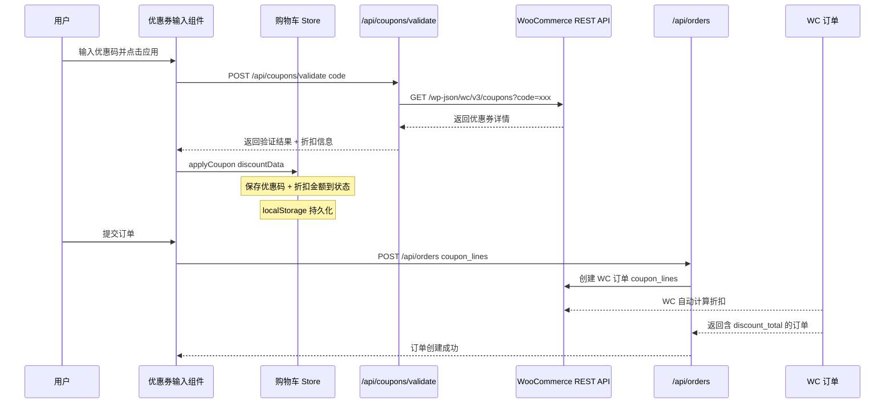

# 优惠券功能设计方案

## 1. 现状分析

### 已有条件
| 组件 | 文件 | 现状 |
|------|------|------|
| 购物车 Store | `src/stores/cart-store.ts` | Zustand + localStorage 持久化，**无优惠券状态** |
| WooCommerce API | `src/lib/woocommerce.ts` | 支持 products/categories/orders/customers，**无 coupons API** |
| 订单创建 | `src/app/api/orders/route.ts` | 创建 WC 订单，**未传递 coupon_lines** |
| 类型定义 | `src/types/woocommerce.ts` | `CreateOrderData` 已预留 `coupon_lines` 字段 |
| 结算页面 | `src/app/checkout/page.tsx` | 830 行，订单摘要区显示小计/运费/总计，**无优惠券入口** |
| 购物车抽屉 | `src/components/cart/cart-drawer.tsx` | 仅显示小计，**无优惠券入口** |
| 购物车页面 | `src/app/cart/page.tsx` | 仅显示商品列表，**无优惠券入口** |

### 关键发现
- `WCOrder.coupon_lines` 和 `WCOrder.discount_total` 字段已存在
- `CreateOrderData.coupon_lines` 类型已预留：`Array<{ code: string }>`
- Stripe 支付流程从 WC 订单获取金额（服务端），天然支持折扣
- PayPal 按钮组件 `CheckoutFormData` 未包含 `coupon_lines`，需要扩展

---

## 2. 整体架构设计

### 2.1 数据流架构



### 2.2 文件变更清单

#### 新增文件
| 文件路径 | 用途 | 类型 |
|---------|------|------|
| `src/app/api/coupons/validate/route.ts` | 优惠券验证 API 端点 | API Route |
| `src/components/checkout/coupon-input.tsx` | 优惠券输入 UI 组件 | Client Component |
| `src/stores/coupon-store.ts` | 优惠券状态管理 Store | Zustand Store |
| `src/types/coupon.ts` | 优惠券类型定义 | 类型文件 |

#### 修改文件
| 文件路径 | 变更内容 |
|---------|---------|
| `src/lib/woocommerce.ts` | 新增 `coupons` API 模块 |
| `src/stores/cart-store.ts` | `calculateTotals` 集成折扣计算 |
| `src/app/checkout/page.tsx` | 集成优惠券组件，传递 coupon_lines |
| `src/components/checkout/paypal-button.tsx` | `CheckoutFormData` 新增 `coupon_lines` |
| `src/components/cart/cart-drawer.tsx` | 订单摘要区显示折扣信息 |
| `src/app/cart/page.tsx` | 订单摘要区显示折扣信息 |
| `src/app/api/orders/route.ts` | 透传 `coupon_lines` 到 WC |

---

## 3. 类型设计

### 3.1 优惠券类型 (`src/types/coupon.ts`)

```typescript
// WooCommerce 优惠券类型
export interface WCCoupon {
  id: number
  code: string
  amount: string
  discount_type: 'percent' | 'fixed_cart' | 'fixed_product'
  description: string
  date_expires: string | null
  usage_limit: number | null
  usage_count: number
  individual_use: boolean
  product_ids: number[]
  product_ids_for_display: number[]
  exclude_product_ids: number[]
  minimum_amount: string
  maximum_amount: string
  email_restrictions: string[]
  used_by: string[]
}

// 验证请求
export interface ValidateCouponRequest {
  code: string
}

// 验证响应
export interface ValidateCouponResponse {
  success: boolean
  coupon?: {
    code: string
    discount_type: WCCoupon['discount_type']
    amount: string
    description?: string
    minimum_amount?: string
  }
  discount?: {
    type: 'percentage' | 'fixed'
    value: number
    display: string       // 例如 "-10%" 或 "-$5.00"
  }
  error?: string
}
```

### 3.2 购物车 Store 扩展

```typescript
// 优惠券状态
interface CouponState {
  appliedCoupon: AppliedCoupon | null
}

interface AppliedCoupon {
  code: string
  discountType: 'percent' | 'fixed_cart' | 'fixed_product'
  amount: string
  description?: string
}

// 优惠券 Actions
interface CouponActions {
  applyCoupon: (coupon: AppliedCoupon) => void
  removeCoupon: () => void
}

// 新增计算值
interface CartComputedValues {
  // 现有
  total: number
  subtotal: number
  itemCount: number
  isEmpty: boolean
  // 新增
  discountAmount: number   // 折扣金额（基于 subtotal 计算）
  discountDisplay: string  // 折扣显示文本
  finalTotal: number       // subtotal - discountAmount（不含运费）
}
```

---

## 4. 后端 API 设计

### 4.1 优惠券验证端点

**端点**: `POST /api/coupons/validate`

**请求体**:
```json
{
  "code": "SAVE10"
}
```

**成功响应**:
```json
{
  "success": true,
  "coupon": {
    "code": "SAVE10",
    "discount_type": "percent",
    "amount": "10",
    "description": "10% off your order"
  },
  "discount": {
    "type": "percentage",
    "value": 10,
    "display": "-10%"
  }
}
```

**错误响应**:
```json
{
  "success": false,
  "error": "Coupon does not exist!"
}
```

### 4.2 实现逻辑 (`src/app/api/coupons/validate/route.ts`)

```typescript
import { NextRequest, NextResponse } from 'next/server'
import { wooCommerce } from '@/lib/woocommerce'

export async function POST(request: NextRequest) {
  try {
    const { code } = await request.json()

    if (!code || typeof code !== 'string' || code.trim() === '') {
      return NextResponse.json(
        { success: false, error: 'Please enter a coupon code' },
        { status: 400 }
      )
    }

    // 调用 WooCommerce API 查询优惠券
    // GET /wp-json/wc/v3/coupons?code=xxx
    const coupons = await wooCommerce.coupons.list({ code: code.trim() })

    if (!coupons || coupons.length === 0) {
      return NextResponse.json(
        { success: false, error: 'Invalid coupon code' }
      )
    }

    const coupon = coupons[0]

    // 检查是否过期
    if (coupon.date_expires) {
      const expiryDate = new Date(coupon.date_expires)
      if (expiryDate < new Date()) {
        return NextResponse.json(
          { success: false, error: 'This coupon has expired' }
        )
      }
    }

    // 构建折扣信息
    const discount = buildDiscountInfo(coupon)

    return NextResponse.json({
      success: true,
      coupon: {
        code: coupon.code,
        discount_type: coupon.discount_type,
        amount: coupon.amount,
        description: coupon.description,
      },
      discount,
    })
  } catch (error) {
    console.error('Coupon validation error:', error)
    return NextResponse.json(
      { success: false, error: 'Failed to validate coupon' },
      { status: 500 }
    )
  }
}

function buildDiscountInfo(coupon: WCCoupon) {
  const amount = parseFloat(coupon.amount)

  switch (coupon.discount_type) {
    case 'percent':
      return {
        type: 'percentage' as const,
        value: amount,
        display: `-${amount}%`,
      }
    case 'fixed_cart':
      return {
        type: 'fixed' as const,
        value: amount,
        display: `-$${amount.toFixed(2)}`,
      }
    case 'fixed_product':
      return {
        type: 'fixed_product' as const,
        value: amount,
        display: `-$${amount.toFixed(2)} per item`,
      }
    default:
      return {
        type: 'fixed' as const,
        value: amount,
        display: `-$${amount.toFixed(2)}`,
      }
  }
}
```

### 4.3 WooCommerce API 扩展 (`src/lib/woocommerce.ts`)

在 `wooCommerce` 导出对象中新增 `coupons` 模块：

```typescript
// Coupons API
const coupons = {
  /**
   * List coupons with optional filters
   */
  list: (params?: { code?: string; per_page?: number }) =>
    wooCommerceAPI<WCCoupon[]>('/coupons', {
      params: params as Record<string, string | number | boolean | undefined>,
    }),

  /**
   * Get a single coupon by ID
   */
  get: (id: number) =>
    wooCommerceAPI<WCCoupon>(`/coupons/${id}`),

  /**
   * Get a coupon by code
   */
  getByCode: async (code: string): Promise<WCCoupon | null> => {
    const results = await wooCommerceAPI<WCCoupon[]>('/coupons', {
      params: { code },
    })
    return results[0] || null
  },
}

// 更新导出
export const wooCommerce = {
  products,
  categories,
  orders,
  customers,
  coupons,  // 新增
}
```

### 4.4 安全性考虑

| 安全措施 | 说明 |
|---------|------|
| 服务端验证 | 优惠券验证在 API Route 中完成，不在前端计算折扣 |
| 金额信任链 | 结算金额从 WC 订单获取，前端仅做展示 |
| 防滥用 | WooCommerce 内置 usage_limit、individual_use 等限制 |
| 订单级验证 | WC 创建订单时会二次验证优惠券，确保有效性 |
| 无敏感数据 | 优惠券 API 不暴露 WC 密钥，通过服务端代理 |

---

## 5. 前端状态管理

### 5.1 独立优惠券 Store (`src/stores/coupon-store.ts`)

设计为独立 Store 而非嵌入 cart-store，遵循单一职责原则：

```typescript
import { create } from 'zustand'
import { persist, createJSONStorage } from 'zustand/middleware'

export interface AppliedCoupon {
  code: string
  discountType: 'percent' | 'fixed_cart' | 'fixed_product'
  amount: string
  description?: string
}

interface CouponState {
  appliedCoupon: AppliedCoupon | null
  isValidating: boolean
  error: string | null
}

interface CouponActions {
  applyCoupon: (coupon: AppliedCoupon) => void
  removeCoupon: () => void
  setIsValidating: (loading: boolean) => void
  setError: (error: string | null) => void
}

type CouponStore = CouponState & CouponActions

export const useCouponStore = create<CouponStore>()(
  persist(
    (set) => ({
      appliedCoupon: null,
      isValidating: false,
      error: null,

      applyCoupon: (coupon) =>
        set({
          appliedCoupon: coupon,
          error: null,
        }),

      removeCoupon: () =>
        set({
          appliedCoupon: null,
          error: null,
        }),

      setIsValidating: (loading) => set({ isValidating: loading }),

      setError: (error) => set({ error }),
    }),
    {
      name: 'coupon-storage',
      version: 1,
      storage: createJSONStorage(() => localStorage),
    }
  )
)

// Selector hooks
export const useAppliedCoupon = () =>
  useCouponStore((s) => s.appliedCoupon)
export const useCouponIsValidating = () =>
  useCouponStore((s) => s.isValidating)
export const useCouponError = () =>
  useCouponStore((s) => s.error)

/**
 * Calculate discount amount based on coupon and subtotal
 */
export function calculateDiscount(
  coupon: AppliedCoupon | null,
  subtotal: number
): number {
  if (!coupon || subtotal <= 0) return 0

  const amount = parseFloat(coupon.amount)
  if (isNaN(amount)) return 0

  switch (coupon.discountType) {
    case 'percent':
      return subtotal * (amount / 100)
    case 'fixed_cart':
      return Math.min(amount, subtotal) // 折扣不超过小计
    case 'fixed_product':
      // 简化处理：fixed_product 在此作为 fixed_cart 使用
      // 完整实现需要遍历购物车项计算
      return Math.min(amount, subtotal)
    default:
      return 0
  }
}
```

### 5.2 数据流示意

```mermaid
graph TB
    subgraph "前端状态"
        CS[coupon-store.ts]
        CartS[cart-store.ts]
        UI[优惠券输入组件]
    end

    subgraph "API 层"
        VAPI[/api/coupons/validate]
        OAPI[/api/orders]
    end

    subgraph "WooCommerce"
        WC_C[coupons endpoint]
        WC_O[orders endpoint]
    end

    UI -->|输入优惠码| CS
    UI -->|POST code| VAPI
    VAPI -->|GET coupons?code| WC_C
    WC_C -->|返回详情| VAPI
    VAPI -->|验证结果| UI
    UI -->|applyCoupon| CS
    CS -->|discountAmount| UI
    CartS -->|subtotal| UI
    UI -->|coupon_lines| OAPI
    OAPI -->|coupon_lines| WC_O
```

---

## 6. 用户交互设计

### 6.1 优惠券输入组件 (`src/components/checkout/coupon-input.tsx`)

**设计要点**：
- 折叠式设计，默认收起，点击 "Have a coupon?" 展开
- 输入框 + 应用按钮
- 已应用时显示优惠码 + 折扣金额 + 移除按钮
- 加载状态和错误提示

```typescript
'use client'

import { useState } from 'react'
import { useCouponStore, useAppliedCoupon } from '@/stores/coupon-store'
import { useCartItems } from '@/stores/cart-store'
import { Button } from '@/components/ui/button'
import { Input } from '@/components/ui/input'

export function CouponInput() {
  const [isOpen, setIsOpen] = useState(false)
  const [code, setCode] = useState('')
  const appliedCoupon = useAppliedCoupon()
  const { isValidating, error, applyCoupon, removeCoupon,
          setIsValidating, setError } = useCouponStore()
  const items = useCartItems()

  const handleApply = async () => {
    if (!code.trim()) return

    setIsValidating(true)
    setError(null)

    try {
      const response = await fetch('/api/coupons/validate', {
        method: 'POST',
        headers: { 'Content-Type': 'application/json' },
        body: JSON.stringify({ code: code.trim() }),
      })

      const data = await response.json()

      if (!data.success) {
        setError(data.error || 'Invalid coupon')
        return
      }

      applyCoupon(data.coupon)
      setCode('')
    } catch (err) {
      setError('Failed to validate coupon')
    } finally {
      setIsValidating(false)
    }
  }

  const handleRemove = () => {
    removeCoupon()
    setCode('')
  }

  // 已应用优惠券的显示
  if (appliedCoupon) {
    return (
      <div className="rounded-lg border border-green-200 bg-green-50 p-4">
        <div className="flex items-center justify-between">
          <div className="flex items-center gap-2">
            <svg className="h-5 w-5 text-green-600" .../>
            <span className="text-sm font-medium text-green-800">
              {appliedCoupon.code}
            </span>
          </div>
          <button
            onClick={handleRemove}
            className="text-sm text-gray-500 hover:text-gray-700"
          >
            Remove
          </button>
        </div>
        {appliedCoupon.description && (
          <p className="mt-1 text-xs text-green-600">
            {appliedCoupon.description}
          </p>
        )}
      </div>
    )
  }

  // 展开/收起状态
  return (
    <div>
      {!isOpen ? (
        <button
          type="button"
          onClick={() => setIsOpen(true)}
          className="text-sm text-gray-600 underline hover:text-black"
        >
          Have a coupon? Enter code here
        </button>
      ) : (
        <div className="space-y-2">
          <div className="flex gap-2">
            <Input
              placeholder="Coupon code"
              value={code}
              onChange={(e) => setCode(e.target.value)}
              onKeyDown={(e) => e.key === 'Enter' && handleApply()}
              disabled={isValidating}
            />
            <Button
              type="button"
              variant="outline"
              onClick={handleApply}
              disabled={isValidating || !code.trim()}
            >
              {isValidating ? 'Applying...' : 'Apply'}
            </Button>
          </div>
          {error && (
            <p className="text-sm text-red-600">{error}</p>
          )}
          <button
            type="button"
            onClick={() => { setIsOpen(false); setError(null) }}
            className="text-xs text-gray-500 hover:underline"
          >
            Cancel
          </button>
        </div>
      )}
    </div>
  )
}
```

### 6.2 UI 展示位置

#### 结算页面 (`src/app/checkout/page.tsx`)

优惠券输入放置在订单摘要区域，运费行上方：

```
┌─────────────────────────────────────┐
│ Order Summary                       │
├─────────────────────────────────────┤
│ [商品列表...]                       │
├─────────────────────────────────────┤
│ Subtotal          $100.00           │
│ Shipping          $10.00            │
│                                         │
│ ┌─────────────────────────────────┐ │
│ │ Have a coupon? Enter code here  │ │
│ │ ┌──────────┐ ┌───────┐         │ │
│ │ │ SAVE10   │ │ Apply │         │ │
│ │ └──────────┘ └───────┘         │ │
│ └─────────────────────────────────┘ │
│                                         │
│ Coupon: SAVE10        -$10.00  [×] │
├─────────────────────────────────────┤
│ Total              $100.00          │
│ (已扣除折扣)                         │
└─────────────────────────────────────┘
```

#### 购物车页面 & 购物车抽屉

在小计下方、运费提示上方添加相同的优惠券输入组件。

### 6.3 总计计算逻辑

```typescript
// 在结算页面中
import { useAppliedCoupon, calculateDiscount } from '@/stores/coupon-store'

// 替代原有的简单计算
const subtotal = total  // 购物车小计
const shippingTotalNumber = parseFloat(shippingTotal) || 0
const discountAmount = calculateDiscount(appliedCoupon, subtotal)
const grandTotal = subtotal - discountAmount + shippingTotalNumber
```

### 6.4 订单摘要显示变更

```tsx
{/* Totals */}
<div className="mt-6 space-y-3 border-t pt-6">
  <div className="flex justify-between text-sm">
    <span className="text-gray-600">Subtotal</span>
    <span>{formatPrice(subtotal, currency)}</span>
  </div>
  <div className="flex justify-between text-sm">
    <span className="text-gray-600">Shipping</span>
    {/* ... 原有逻辑 ... */}
  </div>

  {/* 新增：折扣行 - 仅在有优惠券时显示 */}
  {appliedCoupon && discountAmount > 0 && (
    <div className="flex justify-between text-sm text-green-600">
      <span>Discount ({appliedCoupon.code})</span>
      <span>-{formatPrice(discountAmount, currency)}</span>
    </div>
  )}
</div>

<div className="mt-6 border-t pt-6">
  <div className="flex justify-between text-lg font-medium">
    <span>Total</span>
    <span>{formatPrice(grandTotal, currency)}</span>
  </div>
</div>
```

---

## 7. 订单创建集成

### 7.1 结算页面提交修改

在 `onSubmit` 函数中，为所有支付方式的请求体添加 `coupon_lines`：

```typescript
import { useAppliedCoupon } from '@/stores/coupon-store'

// 在 onSubmit 中
const appliedCoupon = useCouponStore.getState().appliedCoupon

const couponLines = appliedCoupon
  ? [{ code: appliedCoupon.code }]
  : undefined

// 每个支付方式的请求体中添加：
body: JSON.stringify({
  // ... 现有字段
  coupon_lines: couponLines,  // 新增
})
```

### 7.2 订单 API 修改 (`src/app/api/orders/route.ts`)

```typescript
interface OrderRequestBody {
  // ... 现有字段
  coupon_lines?: Array<{ code: string }>  // 新增
}

// 在创建订单时透传
const order = await wooCommerce.orders.create({
  // ... 现有字段
  coupon_lines: body.coupon_lines,  // 新增
}, params)
```

### 7.3 PayPal 组件修改

`CheckoutFormData` 接口新增 `coupon_lines`：

```typescript
export interface CheckoutFormData {
  // ... 现有字段
  coupon_lines?: Array<{ code: string }>  // 新增
}
```

---

## 8. 实施步骤

### 阶段一：基础架构

| 步骤 | 任务 | 文件 |
|------|------|------|
| 1 | 创建优惠券类型定义 | `src/types/coupon.ts` |
| 2 | 在 WooCommerce API 中添加 coupons 模块 | `src/lib/woocommerce.ts` |
| 3 | 创建优惠券验证 API Route | `src/app/api/coupons/validate/route.ts` |
| 4 | 创建优惠券 Zustand Store | `src/stores/coupon-store.ts` |

### 阶段二：UI 组件

| 步骤 | 任务 | 文件 |
|------|------|------|
| 5 | 创建 CouponInput 组件 | `src/components/checkout/coupon-input.tsx` |
| 6 | 在结算页面集成 CouponInput | `src/app/checkout/page.tsx` |
| 7 | 修改订单摘要显示折扣行 | `src/app/checkout/page.tsx` |
| 8 | 修改 grandTotal 计算逻辑 | `src/app/checkout/page.tsx` |

### 阶段三：订单集成

| 步骤 | 任务 | 文件 |
|------|------|------|
| 9 | 订单创建 API 透传 coupon_lines | `src/app/api/orders/route.ts` |
| 10 | CheckoutFormData 新增 coupon_lines | `src/components/checkout/paypal-button.tsx` |
| 11 | 所有支付方式提交时携带 coupon_lines | `src/app/checkout/page.tsx` |

### 阶段四：扩展入口

| 步骤 | 任务 | 文件 |
|------|------|------|
| 12 | 购物车页面集成 CouponInput | `src/app/cart/page.tsx` |
| 13 | 购物车抽屉集成 CouponInput | `src/components/cart/cart-drawer.tsx` |
| 14 | 清理购物车时清除优惠券状态 | `src/stores/cart-store.ts` |

### 阶段五：测试验证

| 步骤 | 任务 |
|------|------|
| 15 | 测试百分比优惠券（如 10% OFF） |
| 16 | 测试固定金额优惠券（如 $5 OFF） |
| 17 | 测试过期优惠券的错误处理 |
| 18 | 测试不存在的优惠码错误处理 |
| 19 | 测试所有支付方式（Stripe/PayPal/BACS/COD）带优惠券下单 |
| 20 | 测试优惠券状态 localStorage 持久化 |
| 21 | 测试购物车清空后优惠券状态清理 |
| 22 | 验证 WC 订单中 discount_total 正确 |
| 23 | TypeScript 编译检查 |
| 24 | 移动端响应式测试 |

---

## 9. 测试要点

### 功能测试
- [ ] 输入有效优惠码 → 显示折扣金额，总计正确减少
- [ ] 输入无效优惠码 → 显示错误提示
- [ ] 输入过期优惠码 → 显示 "coupon has expired"
- [ ] 点击移除 → 折扣消失，总计恢复
- [ ] 刷新页面 → 优惠券状态保持（localStorage）
- [ ] 清空购物车 → 优惠券状态清除
- [ ] Stripe 支付 → WC 订单包含 coupon_lines，discount_total 正确
- [ ] PayPal 支付 → 同上
- [ ] BACS/COD 支付 → 同上
- [ ] 购物车页面/抽屉中也可输入优惠券

### 边界测试
- [ ] 折扣金额超过小计 → 折扣上限为小计金额
- [ ] 空购物车 → 不显示优惠券输入
- [ ] 并发请求 → loading 状态正确
- [ ] 网络错误 → 错误提示友好

### TypeScript
- [ ] `npm run build` 无类型错误
- [ ] 所有新增类型正确导出和导入
