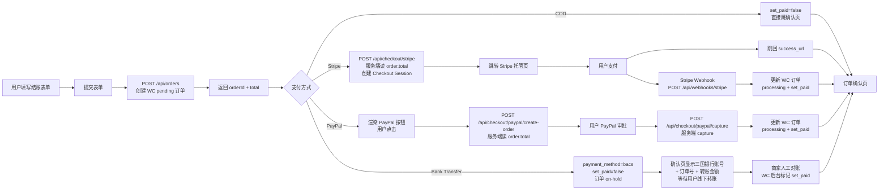
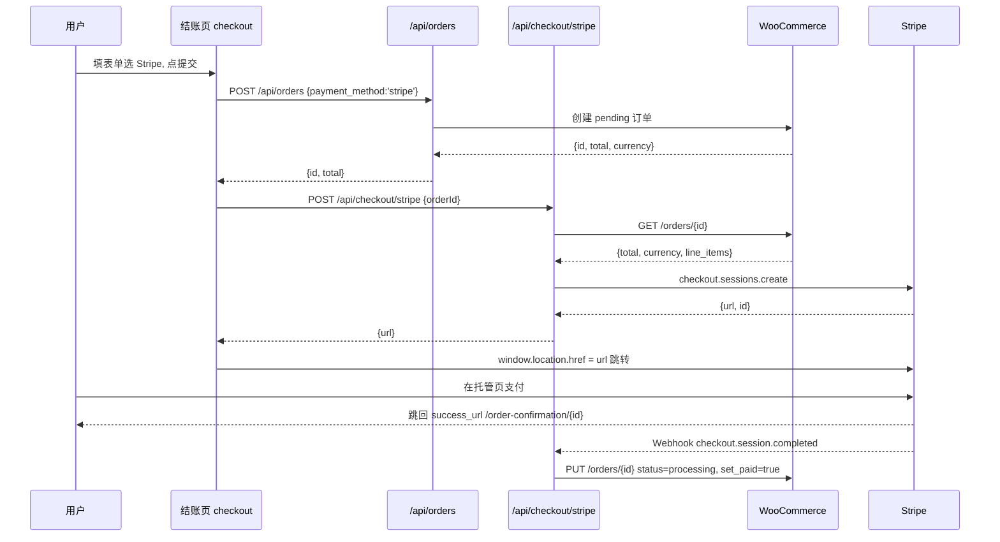
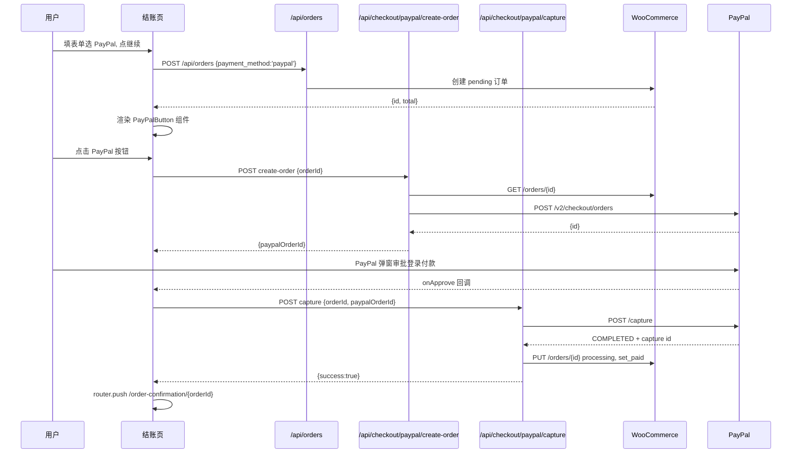
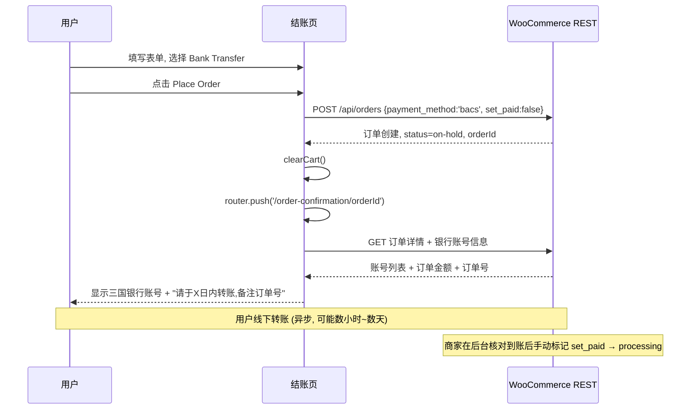
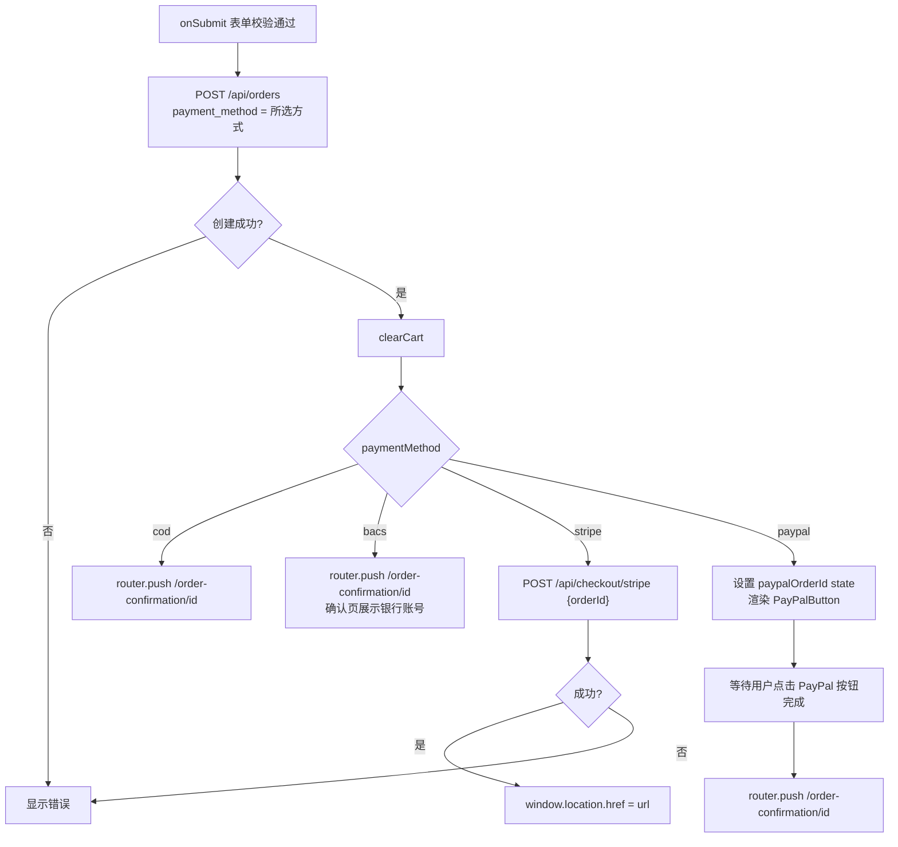
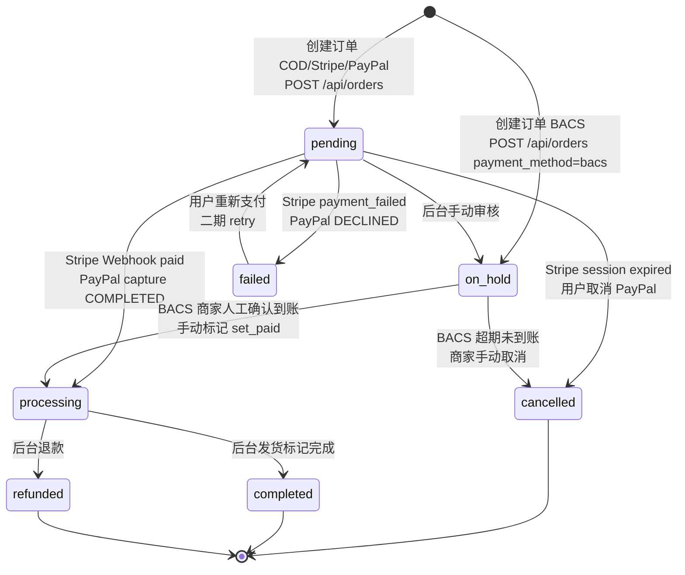
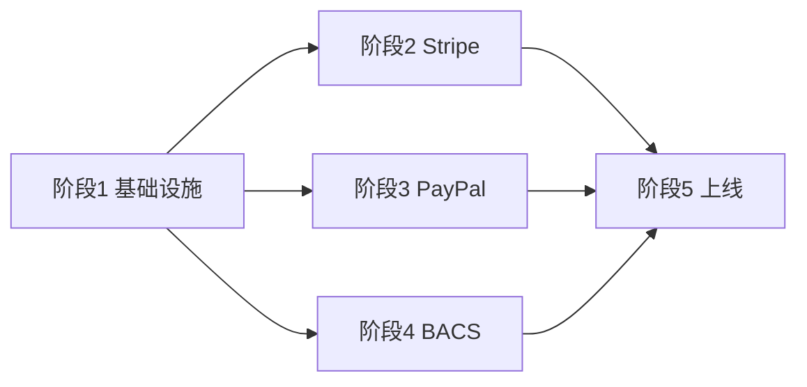

# Stripe + PayPal + 银行转账 支付对接设计方案

> 本文档是 Next.js + WooCommerce 无头电商前端的**生产级支付对接设计规范**，覆盖 Stripe（托管支付页）、PayPal（JS SDK 嵌入按钮）与银行转账（WooCommerce 原生 BACS 线下转账，支持美/英/德三国）三种支付方式，并保留 COD。
>
> - 项目根目录：`/Users/huyuxuan/project/web-project/NovaFrabic-Headless/nextjs-woocommerce-frontend`
> - 技术栈：Next.js 16 (App Router) + TypeScript + Zustand + Tailwind CSS + React Hook Form + Zod
> - 文档语言：简体中文
> - 代码示例仅给出关键接口签名与核心逻辑片段，不包含完整实现

---

## 目录

1. [方案总览与推荐架构](#1-方案总览与推荐架构)
2. [Stripe 对接方案](#2-stripe-对接方案)
3. [PayPal 对接方案](#3-paypal-对接方案)
4. [银行转账(BACS)对接方案](#4-银行转账bacs对接方案)
5. [结账页面改造设计](#5-结账页面改造设计)
6. [订单状态流转设计](#6-订单状态流转设计)
7. [安全性设计](#7-安全性设计)
8. [多币种支持](#8-多币种支持)
9. [实施计划与里程碑](#9-实施计划与里程碑)
10. [需要新增/修改的文件清单](#10-需要新增修改的文件清单)
11. [测试策略](#11-测试策略)

---

## 1. 方案总览与推荐架构

### 1.1 现状基线

当前支付能力仅有 COD，关键事实如下（已通过源码确认）：

| 关注点 | 现状 | 文件 |
|--------|------|------|
| 结账表单 | RHF + Zod，无支付方式字段 | [`checkout/page.tsx`](src/app/checkout/page.tsx:1) |
| 提交逻辑 | 直接 `POST /api/orders`，创建 COD 订单后跳确认页 | [`checkout/page.tsx`](src/app/checkout/page.tsx:119) |
| 订单 API | 硬编码 `payment_method:'cod'`, `set_paid:false` | [`api/orders/route.ts`](src/app/api/orders/route.ts:61) |
| 金额计算 | **WC 服务端按产品现价自动计算 `order.total`** | [`lib/woocommerce.ts`](src/lib/woocommerce.ts:169) |
| 多币种 | `currency-store` 持久化币种，订单 API 透传 `currency` param | [`stores/currency-store.ts`](src/stores/currency-store.ts:1) |
| 类型支持 | `CreateOrderData` 已含 `payment_method`/`set_paid`/`shipping_lines`；`WCOrder` 已含 `status`/`transaction_id`/`date_paid` | [`types/woocommerce.ts`](src/types/woocommerce.ts:217) |
| 确认页 | 服务端拉取订单，不区分支付状态 | [`order-confirmation/[id]/page.tsx`](src/app/order-confirmation/[id]/page.tsx:1) |
| 依赖 | 无任何支付 SDK | [`package.json`](package.json:11) |
| 环境变量 | 无支付相关变量 | [`.env.example`](.env.example:1) |

> **核心安全前提**：WooCommerce 在创建订单时会**根据 `line_items` 中的产品 ID 与 `currency` 参数自动计算订单总额**（`order.total`）。因此前端购物车价格仅为展示用快照，**真实金额必须以 WC 服务端返回的 `order.total` 为准**。这是本方案防篡改设计的基石。

### 1.2 可行方案对比

#### 方案 A：Stripe Checkout（托管支付页）✅ 推荐

Stripe 托管整个支付页面（卡号输入、3DS、Apple/Google Pay），前端只需跳转。

| 维度 | 评价 |
|------|------|
| PCI 合规 | 最低负担，卡数据不接触我方服务器 |
| 开发成本 | 低，仅需创建 Session + 处理 Webhook |
| UI 一致性 | Stripe 托管页样式，无法完全定制 |
| 多币种 | 原生支持，Session 透传 `currency` |
| 异步确认 | 依赖 Webhook 回调更新订单 |

#### 方案 B：Stripe Elements（自托管卡输入）

在结账页内嵌 Stripe Elements 收集卡信息，前端用 PaymentIntent。

| 维度 | 评价 |
|------|------|
| PCI 合规 | 中等，需填写 SAQ A-EP |
| 开发成本 | 中高，需处理 3DS、PaymentIntent 确认 |
| UI 一致性 | 完全可控 |
| 风险 | 自行处理更多边缘场景（网络中断、retry） |

#### 方案 C：PayPal JS SDK + `@paypal/react-paypal-js` ✅ 推荐

PayPal 按钮 + Smart Buttons 内嵌结账页，弹窗/跳转审批。

| 维度 | 评价 |
|------|------|
| 开发成本 | 低，SDK 处理按钮渲染与交互 |
| UX | 站内按钮 → 弹窗审批，体验流畅 |
| 服务端 | 需 create-order + capture 两个服务端调用 |

#### 方案 D：WooCommerce Checkout Block iframe

嵌入原生 WC 结账页。非真正无头，UI 不可控，仅作为可选兜底，**本期不实施**。

#### 方案 E：WooCommerce 原生线下银行转账（BACS）✅ 推荐

使用 WC 内置的 BACS（Bank Account Clearing System）支付方式，商家在 WC 后台配置多国银行账号，结账后展示账号信息供用户手动转账，商家人工对账后标记付款。

| 维度 | 评价 |
|------|------|
| 手续费 | 零（不经过任何支付网关） |
| 开发成本 | 最低，无需支付 SDK，无需 Webhook，无需服务端密钥 |
| 到账速度 | 慢：英国 Faster Payments 数小时~1 天、德国 SEPA 1 个工作日、美国 ACH 数小时~数天 |
| 确认方式 | 人工对账：商家核对到账后手动标记订单为已付款 |
| 风险 | 用户可能转账金额不符 / 不转账，订单长期滞留 on-hold |
| 适用场景 | 大额 B2B 订单、需延迟付款的批发客户、无在线支付覆盖的地区 |

> **三国银行转账通道**：英国（Faster Payments / BACS）、美国（ACH / Wire）、德国（SEPA / SEPA Instant）。账号在 WC 后台 → WooCommerce → Settings → Payments → Bank transfer (BACS) 中配置，可按币种设置多组账号。

### 1.3 推荐架构

**推荐组合：方案 A（Stripe Checkout 托管）+ 方案 C（PayPal JS SDK 嵌入）+ 方案 E（WC 原生 BACS 银行转账）+ 保留 COD。**

推荐理由：
1. **安全优先**：Stripe/PayPal 均避免我方服务器接触敏感支付数据，PCI 合规负担最小；BACS 为线下转账，无在线数据风险。
2. **开发效率**：Stripe Checkout 与 PayPal JS SDK 是官方推荐的最简集成路径；BACS 利用 WC 原生能力，零额外 SDK。
3. **金额可信**：Stripe/PayPal 从 WC 服务端读取 `order.total` 作为支付金额，杜绝前端篡改；BACS 订单金额同样由 WC 服务端计算。
4. **场景互补**：Stripe 覆盖信用卡主力，PayPal 覆盖电子钱包，BACS 覆盖大额/批发/延迟付款场景，COD 覆盖货到付款。
5. **渐进落地**：四者解耦，可独立交付。建议顺序：Stripe → PayPal → BACS → COD 保留。

### 1.4 整体数据流

采用**「订单先行」**模式：用户提交结账表单时，先在 WC 创建一个 `pending` 订单，再根据所选支付方式发起支付。这样即使支付中断，也留有订单记录可追溯。



### 1.5 关键设计原则

1. **金额权威源 = WC `order.total`**：前端 cart total 仅用于展示；所有支付金额由服务端从 WC 订单读取，绝不信任前端传入的金额。
2. **订单先行**：先建 WC `pending` 订单，再发起支付，保证可追溯与可清理。
3. **状态以 Webhook / 服务端 capture 为准**：前端跳转仅作为 UX 引导，订单真实状态由服务端权威更新。
4. **幂等处理**：所有状态更新操作都先读取当前状态再决定是否写入，防止重复处理。
5. **密钥分离**：`*_SECRET` 仅服务端使用，`NEXT_PUBLIC_*` 才可暴露客户端。

---

## 2. Stripe 对接方案

### 2.1 新增 npm 依赖

```bash
npm install stripe @stripe/stripe-js
```

- `stripe`：服务端 Node SDK，用于创建 Checkout Session 与验证 Webhook。
- `@stripe/stripe-js`：客户端 SDK，Stripe Checkout 跳转方案中用于（可选）加载 Stripe.js；本方案以服务端返回 `session.url` 后 `window.location.href` 跳转为主，`@stripe/stripe-js` 作为预留以支持未来 Elements 扩展。

### 2.2 新增环境变量

```env
# Stripe - 服务端密钥（绝不暴露给客户端）
STRIPE_SECRET_KEY=sk_test_xxxxxxxxxxxxxxxx

# Stripe - 客户端可发布密钥
NEXT_PUBLIC_STRIPE_PUBLISHABLE_KEY=pk_test_xxxxxxxxxxxxxxxx

# Stripe - Webhook 签名密钥（用于验证 webhook 来源）
STRIPE_WEBHOOK_SECRET=whsec_xxxxxxxxxxxxxxxx
```

> 生产环境使用 `sk_live_` / `pk_live_` 前缀。

### 2.3 API 路由设计

#### 2.3.1 `POST /api/checkout/stripe` — 创建 Stripe Checkout Session

**文件**：`src/app/api/checkout/stripe/route.ts`（新增）

**职责**：接收 WC 订单 ID，服务端读取订单真实金额，创建 Stripe Checkout Session，返回跳转 URL。

**关键接口签名**：

```typescript
// 请求体
interface StripeCheckoutRequest {
  orderId: number;
}

// 响应体
interface StripeCheckoutResponse {
  sessionId: string;
  url: string; // Stripe 托管支付页地址，前端跳转用
}
```

**核心逻辑要点**：
1. 从请求体取 `orderId`，调用 `wooCommerce.orders.get(orderId)` 获取 WC 订单。
2. **金额来源**：使用 `order.total`（WC 服务端计算），转成最小货币单位 `Math.round(parseFloat(order.total) * 100)`。
3. **币种**：使用 `order.currency`（WC 订单币种），转为小写传给 Stripe（Stripe 要求小写 ISO 4217）。
4. **line_items**：基于 `order.line_items` 构建，每项 `unit_amount` 来自 `parseFloat(item.total) / quantity * 100`，保证与 WC 总额一致。
5. **metadata**：写入 `order_id`、`order_key`、`order_number`，供 Webhook 回写定位订单。
6. **success_url**：`${NEXT_PUBLIC_SITE_URL}/order-confirmation/{orderId}?payment=stripe&status=success&session_id={CHECKOUT_SESSION_ID}`
7. **cancel_url**：`${NEXT_PUBLIC_SITE_URL}/checkout?payment=cancelled&order_id={orderId}`
8. **mode**：`'payment'`（一次性付款）。
9. **customer_email**：使用 `order.billing.email`，预填邮箱。
10. 返回 `{ sessionId, url }`，前端执行 `window.location.href = url`。

**设计要点**：
- 此路由**不接收前端金额**，杜绝篡改。
- 若 `order.status` 已是 `processing`/`completed`，说明已支付，直接返回错误避免重复支付。
- 若 `order.currency` 不在 Stripe 支持列表，返回 400。

#### 2.3.2 `POST /api/webhooks/stripe` — Stripe Webhook 处理

**文件**：`src/app/api/webhooks/stripe/route.ts`（新增）

**职责**：接收 Stripe 事件推送，验证签名，根据事件类型更新 WC 订单状态。

**核心逻辑要点**：
1. **获取原始请求体**：`const body = await request.text()`（**必须用 text，不能 JSON.parse**，否则签名验证失败）。
2. **签名验证**：
   ```typescript
   const signature = request.headers.get('stripe-signature');
   const event = stripe.webhooks.constructEvent(body, signature, STRIPE_WEBHOOK_SECRET);
   ```
   验证失败返回 `400`。
3. **事件处理**（按类型分发）：

| Stripe 事件 | WC 订单动作 |
|-------------|-------------|
| `checkout.session.completed`（`payment_status === 'paid'`） | `status:'processing'`, `set_paid:true`, `transaction_id: payment_intent` |
| `checkout.session.expired` | `status:'cancelled'` |
| `payment_intent.payment_failed` | `status:'failed'` |
| `charge.refunded`（可选，二期） | `status:'refunded'` |

4. **幂等性**：更新前先 `orders.get(orderId)`，若已是 `processing`/`completed` 则跳过（Stripe 会重发 Webhook）。
5. **返回**：`200 { received: true }`（即使跳过也返回 200，避免 Stripe 重试风暴）。
6. **错误处理**：WC 更新失败时返回 `500`，让 Stripe 重试。

**关键设计**：
```typescript
// 幂等检查伪代码
const order = await wooCommerce.orders.get(orderId);
if (order.status === 'processing' || order.status === 'completed') {
  return NextResponse.json({ received: true, skipped: 'already_paid' });
}
await wooCommerce.orders.update(orderId, {
  status: 'processing',
  set_paid: true,
  transaction_id: session.payment_intent as string,
  payment_method: 'stripe',
  payment_method_title: 'Credit Card (Stripe)',
});
```

> ⚠️ **Next.js Webhook body 解析注意**：App Router 的 `route.ts` 默认会解析 body，但 Stripe 签名验证需要**原始字节**。需确保路由不经过任何会提前消费 body 的中间件。使用 `request.text()` 取原始字符串是标准做法。

### 2.4 前端流程



**前端关键步骤**（在 [`checkout/page.tsx`](src/app/checkout/page.tsx:119) 的 `onSubmit` 中）：
1. 提交表单 → `POST /api/orders`（携带 `payment_method: 'stripe'`）→ 得到 `orderId`。
2. 调用 `POST /api/checkout/stripe { orderId }` → 得到 `url`。
3. `window.location.href = url` 跳转 Stripe 托管页。
4. 用户支付后 Stripe 跳回 `success_url`（订单确认页）。
5. **不清空购物车**：跳转离开本站，购物车需在确认页确认支付成功后才清空（避免跳转失败导致购物车丢失）。

> 购物车清理时机：由于 Stripe 跳转会离开站点，**不在提交时清空**。改为在订单确认页加载时，若 `order.status` 为已付款且 URL 带 `?payment=stripe`，则触发 `clearCart()`。或者更稳妥：提交成功创建订单后立即清空（订单已在 WC 落库，即使支付失败也可凭 orderId 重试）。**推荐：创建 WC 订单成功后立即清空购物车**，与现有 COD 行为一致，避免用户重复提交。

### 2.5 WooCommerce 后端配置

1. **安装并启用** WooCommerce Stripe Gateway 插件（用于 WC 后台订单与 Stripe 对账、退款联动）。
2. **本方案不依赖 WC Stripe 插件处理支付**（支付由前端独立对接 Stripe），插件仅用于：
   - 后台订单列表显示 Stripe 交易详情。
   - 通过 WC 后台发起退款时联动 Stripe。
3. **订单状态映射**：在 WC 后台无需额外配置状态映射，本方案通过 REST API 直接 `orders.update` 写入 `status`/`transaction_id`/`set_paid`。
4. **支付方式标识**：WC 订单的 `payment_method` 字段写入 `'stripe'`，`payment_method_title` 写入 `'Credit Card (Stripe)'`，便于后台识别。
5. **WC Stripe 插件 API Key 与本方案 Stripe Secret Key 关系**：可使用同一套 Stripe 账户密钥；若希望前后端独立，也可分别配置。

### 2.6 Webhook 签名验证方案

1. 在 Stripe Dashboard → Developers → Webhooks 添加 endpoint：`https://{NEXT_PUBLIC_SITE_URL}/api/webhooks/stripe`。
2. 订阅事件：`checkout.session.completed`、`checkout.session.expired`、`payment_intent.payment_failed`。
3. 获取 Signing secret → 配置为 `STRIPE_WEBHOOK_SECRET`。
4. 本地开发用 Stripe CLI 转发：`stripe listen --forward-to localhost:3000/api/webhooks/stripe`，CLI 会输出一个临时的 `whsec_` 用于本地。
5. 验证流程：`stripe.webhooks.constructEvent(rawBody, signature, secret)` —— 任何篡改都会抛出 `SignatureVerificationError`，返回 `400`。

---

## 3. PayPal 对接方案

### 3.1 新增 npm 依赖

```bash
npm install @paypal/react-paypal-js
```

- `@paypal/react-paypal-js`：React 封装的 PayPal JS SDK，提供 `PayPalScriptProvider` 与 `PayPalButtons` 组件。
- 服务端 PayPal API 调用使用原生 `fetch`（PayPal REST API v2），无需额外 SDK，保持依赖精简。可封装在 [`src/lib/paypal.ts`](src/lib/paypal.ts:1)。

### 3.2 新增环境变量

```env
# PayPal - 客户端 Client ID（暴露给前端加载 SDK）
NEXT_PUBLIC_PAYPAL_CLIENT_ID=xxxxxxxxxxxxxxxxxxxxxxxx

# PayPal - 服务端 Secret（绝不暴露给客户端）
PAYPAL_CLIENT_SECRET=xxxxxxxxxxxxxxxxxxxxxxxx

# PayPal - API 环境（sandbox / live）
PAYPAL_API_BASE=https://api-m.sandbox.paypal.com
```

> 生产环境 `PAYPAL_API_BASE=https://api-m.paypal.com`。

### 3.3 API 路由设计

#### 3.3.1 `POST /api/checkout/paypal/create-order` — 在 PayPal 创建订单

**文件**：`src/app/api/checkout/paypal/create-order/route.ts`（新增）

**职责**：接收 WC 订单 ID，服务端读取订单金额，调用 PayPal v2 API 创建订单，返回 PayPal Order ID。

**关键接口签名**：

```typescript
// 请求体
interface PayPalCreateOrderRequest {
  orderId: number;
}

// 响应体
interface PayPalCreateOrderResponse {
  paypalOrderId: string; // PayPal 返回的 order id，前端 onApprove 回调用
}
```

**核心逻辑要点**：
1. `wooCommerce.orders.get(orderId)` 取 `order.total` 与 `order.currency`。
2. **金额来源**：`amount.value = order.total`（PayPal 用字符串小数，如 `"49.99"`），`amount.currency_code = order.currency`。
3. 调用 PayPal v2 `POST /v2/checkout/orders`：
   ```typescript
   {
     intent: 'CAPTURE',
     purchase_units: [{
       amount: { currency_code: order.currency, value: order.total },
       custom_id: String(orderId),
       description: `Order #${order.number}`,
     }],
     application_context: {
       shipping_preference: 'NO_SHIPPING', // 物流地址已在 WC 订单采集
       user_action: 'PAY_NOW',
     }
   }
   ```
4. 用 `PAYPAL_CLIENT_ID` + `PAYPAL_CLIENT_SECRET` 获取 access token（client_credentials grant），封装在 [`src/lib/paypal.ts`](src/lib/paypal.ts:1) 的 `getPayPalAccessToken()`。
5. 返回 `{ paypalOrderId: data.id }`。
6. **幂等/重复防护**：若 `order.status` 已 `processing`/`completed`，返回 409 拒绝。

#### 3.3.2 `POST /api/checkout/paypal/capture` — 捕获支付并更新 WC 订单

**文件**：`src/app/api/checkout/paypal/capture/route.ts`（新增）

**职责**：用户 PayPal 审批通过后，前端调用本路由；服务端向 PayPal 捕获资金，成功后更新 WC 订单。

**关键接口签名**：

```typescript
// 请求体
interface PayPalCaptureRequest {
  orderId: number;       // WC 订单 ID
  paypalOrderId: string; // PayPal 订单 ID（create-order 返回的）
}

// 响应体
interface PayPalCaptureResponse {
  success: boolean;
  status: string;        // COMPLETED / DECLINED / ERROR
  transactionId?: string;
}
```

**核心逻辑要点**：
1. 调用 PayPal v2 `POST /v2/checkout/orders/{paypalOrderId}/capture`。
2. 检查返回 `result.status === 'COMPLETED'`，取 `purchase_units[0].payments.captures[0].id` 作为 `transactionId`。
3. **服务端金额复核**（双重保险）：capture 前可再次 `wooCommerce.orders.get(orderId)` 校验 PayPal 订单金额与 WC `order.total` 一致，不一致则拒绝 capture 并记日志。
4. 更新 WC 订单：
   ```typescript
   await wooCommerce.orders.update(orderId, {
     status: 'processing',
     set_paid: true,
     payment_method: 'paypal',
     payment_method_title: 'PayPal',
     transaction_id: transactionId,
   });
   ```
5. **幂等性**：更新前检查 `order.status`，已 `processing`/`completed` 则跳过更新但仍返回 `success: true`（防止前端重试重复 capture 报错）。
6. capture 失败（`DECLINED`）：更新 WC 订单 `status: 'failed'`，返回 `status: 'DECLINED'`。
7. PayPal API 异常：返回 `500` + `status: 'ERROR'`，前端提示用户重试。

### 3.4 前端流程



**前端关键步骤**：
1. 选 PayPal 后，用户点击「继续到 PayPal」按钮 → 先 `POST /api/orders` 创建 WC pending 订单 → 得到 `orderId`。
2. 用 `orderId` 渲染 [`PayPalButton`](src/components/checkout/paypal-button.tsx:1) 组件。
3. PayPalButton `createOrder` 回调 → `POST /api/checkout/paypal/create-order { orderId }` → 返回 `paypalOrderId`。
4. 用户审批 → `onApprove` 回调 → `POST /api/checkout/paypal/capture { orderId, paypalOrderId }`。
5. capture 成功 → `clearCart()` + `router.push('/order-confirmation/' + orderId)`。
6. capture 失败 → 显示错误，WC 订单已是 pending/failed，可重试。

### 3.5 关键代码设计要点

**PayPal Provider**（`src/components/providers/paypal-provider.tsx`，新增）：
```typescript
'use client';
import { PayPalScriptProvider } from '@paypal/react-paypal-js';

export function PayPalProvider({ children, currency }: {
  children: React.ReactNode;
  currency: string;
}) {
  return (
    <PayPalScriptProvider options={{
      clientId: process.env.NEXT_PUBLIC_PAYPAL_CLIENT_ID!,
      currency,          // 动态传入当前币种
      intent: 'capture',
      components: 'buttons',
    }}>
      {children}
    </PayPalScriptProvider>
  );
}
```

**PayPal Button**（`src/components/checkout/paypal-button.tsx`，新增）：
```typescript
interface PayPalButtonProps {
  orderId: number;
  amount: string;       // 仅用于禁用态判断，真实金额以服务端为准
  currency: string;
  onSuccess: (orderId: number) => void;
  onError: (error: unknown) => void;
}
// createOrder: fetch /api/checkout/paypal/create-order → return paypalOrderId
// onApprove: fetch /api/checkout/paypal/capture → onSuccess(orderId)
```

**PayPal 服务端封装**（`src/lib/paypal.ts`，新增）：
```typescript
export async function getPayPalAccessToken(): Promise<string>;
export async function createPayPalOrder(params: {
  wcOrderId: number; total: string; currency: string; number: string;
}): Promise<{ id: string }>;
export async function capturePayPalOrder(paypalOrderId: string): Promise<{
  status: string; transactionId?: string;
}>;
```

### 3.6 WooCommerce 后端配置

1. **安装并启用** WooCommerce PayPal Payments 插件（同样仅用于后台对账与退款联动）。
2. 本方案支付由前端独立完成，WC PayPal 插件不参与结账流程。
3. WC 订单 `payment_method` 写入 `'paypal'`，`payment_method_title` 写入 `'PayPal'`。
4. 若需 PayPal Webhook 同步（可选，二期）：在 PayPal Developer → Apps → Webhooks 添加 `https://{SITE_URL}/api/webhooks/paypal`，订阅 `PAYMENT.CAPTURE.COMPLETED`，用于 capture API 调用失败时的兜底状态同步。本期以 **capture 同步验证为主**，Webhook 为可选增强。

### 3.7 Webhook 或同步验证方案

- **主方案（同步验证）**：`/api/checkout/paypal/capture` 在用户支付流程中同步调用 PayPal capture API 并立即更新 WC 订单。优点：实时、无需额外 endpoint、无签名验证复杂度。
- **增强方案（PayPal Webhook，二期可选）**：`POST /api/webhooks/paypal` 接收 `PAYMENT.CAPTURE.COMPLETED`，验证 Webhook 签名（PayPal 需校验 `PAYPAL-TRANSMISSION-SIG` 等 header，较复杂），用于 capture API 异常时的兜底。本期暂不实施，文档中预留路径与说明。

---

## 4. 银行转账(BACS)对接方案

### 4.1 方案定位与适用场景

银行转账采用 **WooCommerce 原生 BACS（Bank Transfer）线下转账方式**，零手续费、零在线网关依赖。用户下单后系统展示商家银行账号，用户自行到银行/网银完成转账，商家在 WC 后台人工对账到账后标记付款。

**适用场景**：
- 大额 B2B/批发订单（避免在线支付高额手续费）
- 需要延迟付款或对公转账的企业客户
- 美/英/德三国本地客户偏好的本地银行通道

**三国通道与到账时效**：

| 国家 | 转账网络 | 到账时效 | 币种 |
|------|----------|----------|------|
| 英国 🇬🇧 | Faster Payments / BACS | 数分钟~1 个工作日 | GBP |
| 德国 🇩🇪 | SEPA / SEPA Instant Credit Transfer | 1 个工作日 / 即时 | EUR |
| 美国 🇺🇸 | ACH / Wire Transfer | 数小时~数天 / 当日 | USD |

### 4.2 需要新增的 npm 依赖

**无**。BACS 完全依赖 WooCommerce 原生能力与 REST API，不需要任何额外 SDK 或第三方库。复用现有 [`src/lib/woocommerce.ts`](src/lib/woocommerce.ts:1) 的 `orders.create` / `orders.get` / `orders.update` 即可。

### 4.3 需要新增的环境变量

**无**。BACS 不涉及第三方支付密钥。银行账号信息在 WC 后台配置，通过 WC REST API 读取展示（见 [4.6](#46-读取银行账号信息)）。

### 4.4 API 路由设计

BACS **不需要新增任何 API 路由**。订单创建复用现有的 [`POST /api/orders`](src/app/api/orders/route.ts:1)，改造后透传 `payment_method: 'bacs'`、`payment_method_title: 'Bank Transfer'`、`set_paid: false`。

WC 创建 BACS 订单后，**默认自动将订单状态设为 `on-hold`**（WC 对 BACS 方式的内置行为），等待商家确认收款后手动改为 `processing`。

> 如需读取银行账号信息展示给用户，新增一个轻量只读接口（见 [4.6](#46-读取银行账号信息)）。

### 4.5 前端流程

采用**「订单先行」**模式，与 COD 分支高度相似，差异在于确认页需展示银行账号指引：



**关键步骤**：
1. 用户在结账页选择「Bank Transfer」支付方式，提交表单。
2. `POST /api/orders` 创建 WC 订单，`payment_method: 'bacs'`，`set_paid: false`。WC 自动将订单设为 `on-hold`。
3. 前端 `clearCart()` 后 `router.push('/order-confirmation/${orderId}')`。
4. 订单确认页（服务端组件）拉取订单详情 + 银行账号信息，渲染转账指引区块（账号、收款人、订单号、金额、转账期限）。
5. 用户线下完成转账（异步，可能数小时~数天）。
6. 商家在 WC 后台核对到账后，手动将订单标记为 `processing`（或通过 [`orders.update`](src/lib/woocommerce.ts:169) 设 `set_paid: true`）。

### 4.6 读取银行账号信息

WooCommerce 将 BACS 账号配置存储在 `woocommerce_bacs_accounts` option 中。无头前端读取方案有两种：

**方案 1（推荐）：新增只读 API 路由 `GET /api/payment/bacs/accounts`**

通过 WP REST API 读取 BACS 账号配置。需在 WordPress 端注册一个轻量自定义端点（或使用 WPGraphQL 扩展），返回结构化账号列表：

```typescript
// GET /api/payment/bacs/accounts?currency=GBP
// 返回示例
[
  {
    country: 'GB',
    currency: 'GBP',
    accountName: 'NovaFabric Ltd',
    accountNumber: '12345678',
    sortCode: '12-34-56',     // 英国 Sort Code
    bankName: 'Barclays Bank',
    iban: 'GB29 NWBK 6016 1331 9268 19',
    swift: 'NW BKGB 2L',       // SWIFT/BIC
    instructions: 'Please include order number as reference.'
  },
  {
    country: 'DE',
    currency: 'EUR',
    accountName: 'NovaFabric GmbH',
    iban: 'DE89 3704 0044 0532 0130 00',
    swift: 'COBA DE FF XXX',
    bankName: 'Commerzbank',
    instructions: 'Bitte verwenden Sie die Bestellnummer als Verwendungszweck.'
  },
  {
    country: 'US',
    currency: 'USD',
    accountName: 'NovaFabric Inc',
    accountNumber: '000123456789',
    routingNumber: '021000021', // 美国 Routing Number
    bankName: 'JPMorgan Chase',
    instructions: 'Please include order number as payment reference.'
  }
]
```

> 前端按 `order.currency` 过滤展示对应币种的账号（GBP 账单显示英国账号，EUR 显示德国 SEPA 账号，USD 显示美国账号）。

**方案 2（最简兜底）：硬编码账号到前端常量**

若暂不开发 WordPress 自定义端点，可将三国账号作为前端常量写入 [`src/lib/bacs-accounts.ts`](src/lib/bacs-accounts.ts:1)。**缺点**：账号变更需改代码重新部署。仅建议作为初期快速上线方案，后续迁移到方案 1。

**类型定义**（新增到 [`src/types/woocommerce.ts`](src/types/woocommerce.ts:1)）：
```typescript
export interface BACSBankAccount {
  country: string;       // 'GB' | 'DE' | 'US'
  currency: string;      // 'GBP' | 'EUR' | 'USD'
  accountName: string;
  accountNumber?: string;
  sortCode?: string;       // 英国
  routingNumber?: string;  // 美国
  iban?: string;           // 德国/国际
  swift?: string;          // SWIFT/BIC
  bankName: string;
  instructions?: string;
}
```

### 4.7 关键代码设计要点

**结账页提交分支**（[`src/app/checkout/page.tsx`](src/app/checkout/page.tsx:119) 的 `onSubmit`，BACS 分支）：
```typescript
// 与 COD 分支几乎一致：创建订单后直接跳确认页
case 'bacs':
  // POST /api/orders 已透传 payment_method:'bacs'
  // 创建成功后 clearCart + 跳转确认页
  // 确认页负责展示银行账号指引
  break;
```

**订单确认页改造**（[`src/app/order-confirmation/[id]/page.tsx`](src/app/order-confirmation/[id]/page.tsx:1)）：
- 当 `order.payment_method === 'bacs'` 且 `order.status === 'on-hold'` 时，渲染 [`BankTransferInstructions`](src/components/checkout/bank-transfer-instructions.tsx:1) 组件。
- 组件展示：订单号、应付金额（含币种）、三国中对应币种的银行账号、转账期限提示（如「请于 3 个工作日内完成转账」）、备注订单号的要求。

**订单 API 改造**（[`src/app/api/orders/route.ts`](src/app/api/orders/route.ts:5)）：
- `OrderRequestBody` 接收 `payment_method`，BACS 时透传 `'bacs'`、`payment_method_title: 'Bank Transfer'`、`set_paid: false`。
- WC 会自动将 BACS 订单设为 `on-hold`（无需前端额外指定 status）。

### 4.8 WooCommerce 后端配置

1. **启用 BACS 方式**：WC 后台 → Settings → Payments → 勾选启用「Bank transfer (BACS)」。
2. **配置三国银行账号**：点击 Set up → 添加三组账号：
   - 英国账号：Account Name / Account Number / Sort Code / Bank Name / IBAN / SWIFT
   - 德国账号：Account Name / IBAN / SWIFT / Bank Name
   - 美国账号：Account Name / Account Number / Routing Number / Bank Name
3. **多币种账号匹配**：WC BACS 支持按账号配置「Account Type」与说明，前端按 `order.currency` 选择展示。WC 原生不按币种自动过滤账号，由前端按 `currency` 字段过滤（见 [4.6](#46-读取银行账号信息)）。
4. **说明文案**：在每条账号的「Description」字段填写转账指引（含「请备注订单号」）。
5. **无需插件**：BACS 是 WooCommerce 核心内置功能，无需安装额外插件。

### 4.9 人工对账与订单状态流转

BACS 的订单确认依赖**人工对账**，流程如下：

| 步骤 | 操作方 | 状态变化 |
|------|--------|----------|
| 1. 下单 | 系统/用户 | 创建订单 → `on-hold`，`set_paid: false` |
| 2. 转账 | 用户（线下） | 订单状态不变，仍 `on-hold` |
| 3. 核对到账 | 商家（WC 后台） | 手动标记付款 → `processing`，`set_paid: true`，`date_paid` 自动写入 |
| 4. 超期未到账 | 商家（WC 后台） | 手动取消 → `cancelled`，或联系客户 |

> BACS 订单**不经过任何 Webhook 或自动状态更新**，全部由商家在 WC 后台人工操作。前端确认页对 `on-hold` 状态显示「等待您的转账，商家确认到账后订单将进入处理中」。

### 4.10 超时与异常处理

- **超期未转账**：建议在确认页文案中注明转账期限（如 3~7 个工作日）。超期后由商家在 WC 后台手动取消订单（`cancelled`）。
- **金额不符**：用户转账金额与订单金额不一致时，由商家在后台判断（部分付款 → 联系客户补款；多付 → 安排退款或冲抵）。
- **重复转账/无备注**：依赖订单号备注匹配，无备注时商家需通过金额+时间人工匹配，风险由运营流程承担。
- **确认页轮询（可选，二期）**：BACS 订单确认页可不轮询（因状态变更依赖人工）。若需在用户重新访问时刷新状态，可复用 [`OrderStatusPoller`](src/components/checkout/order-status-poller.tsx:1) 但拉长轮询间隔（如每 30 秒，最多 3 次），仅为用户体验，不作为状态权威来源。

---

## 5. 结账页面改造设计

### 5.1 支付方式选择 UI 设计

新增组件 [`src/components/checkout/payment-method-selector.tsx`](src/components/checkout/payment-method-selector.tsx:1)（客户端组件），用于在结账左栏渲染支付方式单选卡片。

**UI 设计**：
- Radio 卡片组，每个选项一行：图标 + 名称 + 简短说明。
- 四个选项：
  - `stripe`：💳 Credit / Debit Card（Stripe）— "Secure card payment via Stripe"
  - `paypal`：🅿️ PayPal — "Pay with your PayPal account"
  - `bacs`：🏦 Bank Transfer — "Pay by bank transfer (US/UK/DE). We'll confirm after receipt."
  - `cod`：💵 Cash on Delivery — "Pay when you receive your order"
- 选中态：边框高亮（`border-black`），未选中灰边，使用 [`cn()`](src/lib/utils.ts:7) 合并类名。
- 与 RHF 集成：通过 `register('paymentMethod')` 受控，或用 `Controller` + `setValue`。

**接口签名**：
```typescript
interface PaymentMethodSelectorProps {
  value: PaymentMethod;
  onChange: (method: PaymentMethod) => void;
  disabled?: boolean;
}
type PaymentMethod = 'stripe' | 'paypal' | 'bacs' | 'cod';
```

### 5.2 提交流程改造

改造 [`src/app/checkout/page.tsx`](src/app/checkout/page.tsx:119) 的 `onSubmit`，按 `paymentMethod` 分流：



**状态管理新增**（在 checkout page 中）：
```typescript
const [pendingOrderId, setPendingOrderId] = useState<number | null>(null);
const [paymentStep, setPaymentStep] = useState<'form' | 'paypal-button'>('form');
```

**PayPal 分支的特殊处理**：
- 选 PayPal 时，提交按钮文案改为「继续到 PayPal」。
- 提交创建 WC 订单后，**不立即跳转**，而是切换到 `paymentStep: 'paypal-button'`，在表单下方渲染 PayPalButton 区域。
- 用户完成 PayPal 流程后，capture 成功回调中 `router.push`。
- 提供「返回修改」链接，允许用户取消 PayPal 流程回到表单（此时 WC 订单保持 pending，可后续清理）。

**Stripe/COD/BACS 分支**：提交后直接跳转确认页，行为与现有一致；BACS 的银行账号指引在确认页渲染。

### 5.3 表单 schema 变更

在 [`checkout/page.tsx`](src/app/checkout/page.tsx:17) 的 `checkoutSchema` 中新增字段：

```typescript
const checkoutSchema = z.object({
  // ... 现有字段保持不变
  paymentMethod: z.enum(['stripe', 'paypal', 'bacs', 'cod']).default('stripe'),
});
```

- 默认值设为 `'stripe'`（信用卡为主推方式）。
- `defaultValues` 中补充 `paymentMethod: 'stripe'`。
- Zod `enum` 提供类型安全，非法值会在校验时报错。

**`CheckoutFormData` 类型** 自动通过 `z.infer` 获得 `paymentMethod` 字段，无需手动扩展。

### 5.4 订单确认页改造

改造 [`src/app/order-confirmation/[id]/page.tsx`](src/app/order-confirmation/[id]/page.tsx:1)：

1. **根据 `order.status` 显示不同横幅**（新增组件 [`src/components/checkout/order-status-banner.tsx`](src/components/checkout/order-status-banner.tsx:1)）：

| `order.status` | `date_paid` | 显示文案 | 图标/颜色 |
|----------------|-------------|----------|-----------|
| `processing` / `completed` | 有值 | "Thank you! Payment received." | 绿色 ✓ |
| `pending` | 无 | "Payment confirmation in progress..." | 黄色 ⏳ |
| `failed` | 无 | "Payment failed. Please retry." | 红色 ✗ |
| `cancelled` | 无 | "Order cancelled." | 灰色 ⊘ |
| `on-hold` | 无 | "Awaiting your bank transfer. We'll process once payment is received." | 黄色 ⏸ |

2. **Stripe 竞态处理**：用户从 Stripe 跳回确认页时，Webhook 可能尚未到达，`order.status` 仍为 `pending`。处理方案：
   - 确认页服务端获取订单后，若 `status === 'pending'` 且 URL 带 `?payment=stripe`，渲染「支付确认中」横幅 + 客户端轮询组件。
   - 新增客户端组件 [`src/components/checkout/order-status-poller.tsx`](src/components/checkout/order-status-poller.tsx:1)：每 3 秒调用一个轻量接口（复用 `wooCommerce.orders.get` 或新增 `GET /api/orders/[id]/status`）轮询，最多 10 次；一旦 `status` 变为 `processing` 则刷新页面。
   - 超时未确认：提示「若已付款，请稍后查看邮件确认」，避免无限等待。

3. **支付方式展示**：现有确认页已展示 `order.payment_method_title`，无需改动，Stripe/PayPal/BACS/COD 均可正确显示。

4. **BACS 银行转账指引区块**：当 `order.payment_method === 'bacs'` 且 `order.status === 'on-hold'` 时，渲染新增组件 [`src/components/checkout/bank-transfer-instructions.tsx`](src/components/checkout/bank-transfer-instructions.tsx:1)：
   - 展示订单号、应付金额（含币种，使用 [`formatPrice`](src/lib/currency.ts:7) 传入 `order.currency`）。
   - 按 `order.currency` 过滤并展示对应国家银行账号（GBP→英国、EUR→德国、USD→美国），含账号/IBAN/SWIFT/Sort Code/Routing Number 等字段。
   - 提示文案：「请于 X 个工作日内完成转账，并在转账备注中填写订单号 #{order.number}，以便我们核对。」
   - 提供「复制」按钮便于用户复制账号信息（可选，使用 `navigator.clipboard`）。

5. **失败订单重试入口**：当 `status === 'failed'` 且 `payment_method === 'stripe'`，提供「重新支付」按钮，链接到 `/checkout?retry_order={orderId}`（可选，二期）。

### 5.5 提交按钮文案动态化

桌面端提交按钮（[`checkout/page.tsx`](src/app/checkout/page.tsx:479)）与移动端按钮（[:485](src/app/checkout/page.tsx:485)）文案根据 `paymentMethod` 变化：

| paymentMethod | 按钮文案 |
|---------------|----------|
| `stripe` | `Pay {formatPrice(total, currency)}` |
| `paypal` | `Continue to PayPal` |
| `bacs` | `Place Order` |
| `cod` | `Place Order` |

loading 态文案统一为 `Processing...`。

---

## 6. 订单状态流转设计

### 6.1 WC 订单状态流转图



### 6.2 不同支付场景的状态映射

| 场景 | 触发 | WC 状态变化 | `set_paid` | `transaction_id` | `date_paid` |
|------|------|-------------|-----------|------------------|-------------|
| COD 下单 | 提交表单 | 新建 `pending` | false | 空 | 空 |
| BACS 下单 | 提交表单 | 新建 `on-hold` | false | 空 | 空 |
| BACS 确认到账 | 商家 WC 后台手动标记 | `on-hold`→`processing` | true | 空（人工） | 自动写入 |
| BACS 超期未转账 | 商家 WC 后台手动取消 | `on-hold`→`cancelled` | false | 空 | 空 |
| Stripe 支付成功 | Webhook `checkout.session.completed` | `pending`→`processing` | true | payment_intent | 自动写入 |
| Stripe 用户取消 | 跳回 cancel_url | 保持 `pending` | false | 空 | 空 |
| Stripe 会话过期 | Webhook `checkout.session.expired` | `pending`→`cancelled` | false | 空 | 空 |
| Stripe 支付失败 | Webhook `payment_intent.payment_failed` | `pending`→`failed` | false | 空 | 空 |
| PayPal 支付成功 | capture API 返回 COMPLETED | `pending`→`processing` | true | capture id | 自动写入 |
| PayPal 用户拒绝 | onApprove 未触发 / capture DECLINED | `pending`→`failed` | false | 空 | 空 |

### 6.3 订单确认页根据支付状态显示 UI

确认页读取 `order.status` 与 `order.date_paid`（详见 [5.4](#54-订单确认页改造)）。关键判断逻辑：

```typescript
const isPaid = !!order.date_paid || order.status === 'processing' || order.status === 'completed';
const isPending = order.status === 'pending';
const isOnHold = order.status === 'on-hold';
const isFailed = order.status === 'failed';
const isCancelled = order.status === 'cancelled';
```

- `isPaid`：显示成功横幅 + 完整订单详情（现有 UI）。
- `isPending`：显示「确认中」横幅 + 订单详情 + 轮询组件（Stripe 场景）。
- `isOnHold`：显示「等待您的银行转账」横幅 + 订单详情 + [`BankTransferInstructions`](src/components/checkout/bank-transfer-instructions.tsx:1) 转账指引（BACS 场景）。
- `isFailed`/`isCancelled`：显示对应横幅 + 订单详情 + 重试/联系客服入口。

### 6.4 失败/取消场景处理

**Stripe 取消**（用户在 Stripe 页点返回）：
- 跳回 `cancel_url` = `/checkout?payment=cancelled&order_id={id}`。
- 结账页检测到 `?payment=cancelled`，显示提示「Payment cancelled. Your order is saved, you can retry.」。
- WC 订单保持 `pending`，用户可重新选择支付方式对同一 `orderId` 发起新的 Stripe Session（需在 `/api/checkout/stripe` 中允许 pending 订单重复创建 Session）。

**PayPal 拒绝/关闭弹窗**：
- `onError` 回调触发，显示错误提示，WC 订单保持 `pending`。
- 用户可点击 PayPal 按钮重试。

**支付成功但 Webhook 延迟**（Stripe）：
- 确认页轮询机制兜底（见 [5.4](#54-订单确认页改造)）。

**BACS 超期/金额不符**（人工对账）：
- 用户未在约定期限内转账：商家在 WC 后台手动将 `on-hold` 订单改为 `cancelled`，可附内部备注。
- 转账金额不符：商家在后台判断（部分付款 → 联系客户补款；多付 → 安排退款或冲抵下单）。
- 无订单号备注导致无法匹配：依赖金额+时间人工匹配，匹配失败的联系客户核实。

**僵尸 pending/on-hold 订单清理**（运维）：
- 建议在 WC 后台或通过定时任务清理超过 N 小时仍 `pending` 且无支付意图的订单，以及超过约定转账期限仍 `on-hold` 的 BACS 订单（二期，非本期范围）。

---

## 7. 安全性设计

### 7.1 Webhook 签名验证

**Stripe**：
- `stripe.webhooks.constructEvent(rawBody, signature, STRIPE_WEBHOOK_SECRET)` 强制验证。
- 必须使用 `request.text()` 获取原始 body，不能用 `request.json()`（会改变字节序列导致签名失配）。
- 验证失败返回 `400`，记录告警日志。

**PayPal（二期 Webhook，预留）**：
- 校验 `PAYPAL-TRANSMISSION-SIG`、`PAYPAL-CERT-URL`、`PAYPAL-TRANSMISSION-ID` 等 header。
- 使用 PayPal 官方验证 API 或库验证签名。本期以同步 capture 为主，暂不实施。

**BACS**：无 Webhook，无签名验证需求。BACS 订单状态变更完全由商家在 WC 后台人工操作，不存在自动回调被伪造的风险。

### 7.2 客户端密钥与服务端密钥分离

| 变量 | 暴露范围 | 用途 |
|------|----------|------|
| `STRIPE_SECRET_KEY` | 仅服务端 | 创建 Session、验证 Webhook |
| `NEXT_PUBLIC_STRIPE_PUBLISHABLE_KEY` | 客户端 | 预留 Elements 扩展 |
| `STRIPE_WEBHOOK_SECRET` | 仅服务端 | Webhook 签名验证 |
| `PAYPAL_CLIENT_SECRET` | 仅服务端 | 获取 access token、create/capture |
| `NEXT_PUBLIC_PAYPAL_CLIENT_ID` | 客户端 | 加载 PayPal JS SDK |
| `WC_CONSUMER_KEY/SECRET` | 仅服务端 | WC REST API Basic Auth（现有） |

**规则**：
- 任何不带 `NEXT_PUBLIC_` 前缀的变量，Next.js 不会打包进客户端 bundle，天然隔离。
- API 路由中只使用服务端变量。
- 在 [`next.config.ts`](next.config.ts:44) 的 `env` 块中，**只显式声明 `NEXT_PUBLIC_*` 变量**，确保不误暴露 secret。

### 7.3 防止金额篡改

**核心策略：金额权威源 = WooCommerce 服务端 `order.total`。**

1. 前端**不向任何支付 API 传递金额**。
2. `/api/checkout/stripe` 与 `/api/checkout/paypal/create-order` 都通过 `wooCommerce.orders.get(orderId)` 读取真实金额。
3. WC 创建订单时根据 `line_items`（产品 ID + 数量）与 `currency` param 自动计算 `order.total`，产品价格来自 WC 后台，前端无法篡改。
4. **PayPal 额外复核**：capture 前比对 PayPal 订单金额与 WC `order.total`，不一致则拒绝并告警。
5. **订单状态前置校验**：创建支付意向前检查 `order.status`，已支付订单拒绝重复发起。
6. **BACS 金额**：BACS 订单金额同样由 WC 服务端计算，确认页展示的转账金额来自 `order.total`，用户照此金额线下转账，商家对账时以此为核对基准。

### 7.4 支付回调幂等性处理

**Stripe Webhook 幂等**：
```typescript
const order = await wooCommerce.orders.get(orderId);
if (order.status === 'processing' || order.status === 'completed') {
  // 已处理，跳过，但仍返回 200 避免 Stripe 重试风暴
  return NextResponse.json({ received: true, skipped: 'already_processed' });
}
await wooCommerce.orders.update(orderId, { status: 'processing', set_paid: true, ... });
```

**PayPal capture 幂等**：
```typescript
const order = await wooCommerce.orders.get(orderId);
if (order.status === 'processing' || order.status === 'completed') {
  return NextResponse.json({ success: true, status: 'ALREADY_PAID', transactionId: order.transaction_id });
}
// 执行 capture...
```

**前端重试幂等**：
- 用户网络抖动重试提交时，`/api/orders` 可能创建多个 pending 订单。这是已知行为，建议二期引入客户端幂等 token（如提交时生成 uuid 存 sessionStorage，重复提交复用同一 token）。
- 本期接受少量重复 pending 订单，由运维清理任务兜底。

### 7.5 其他安全措施

- **HTTPS 强制**：所有支付相关请求必须 HTTPS（生产环境）。
- **速率限制**：对 `/api/checkout/*` 与 `/api/webhooks/*` 建议加 IP 速率限制（二期，可用中间件或 Vercel/Cloudflare 层）。
- **日志审计**：所有支付 API 与 Webhook 记录 `orderId`、`paymentMethod`、金额、状态变更，便于对账与排查。**不记录敏感卡号**（Stripe/PayPal 托管方案本就不接触卡号）。
- **CSRF**：API 路由为 JSON POST，浏览器同源策略 + Next.js 默认提供基础防护；如需加强可二期引入 CSRF token。
- **BACS 银行账号展示安全**：银行账号信息为公开收款信息（用户需据此转账），展示无安全风险。但 `/api/payment/bacs/accounts` 接口应加速率限制，避免被批量爬取。账号变更应通过 WC 后台而非代码，降低误操作风险。

---

## 8. 多币种支持

### 8.1 现有多币种体系

- [`src/stores/currency-store.ts`](src/stores/currency-store.ts:1) 持久化当前币种（`USD`/`EUR`/`GBP`），由 [`src/components/providers/currency-provider.tsx`](src/components/providers/currency-provider.tsx:1) 通过 IP 地理检测初始化。
- [`src/lib/currency.ts`](src/lib/currency.ts:7) 定义 `SupportedCurrency = 'USD' | 'EUR' | 'GBP'` 及 `CURRENCIES` 配置（code/symbol/locale）。
- [`src/app/api/orders/route.ts`](src/app/api/orders/route.ts:56) 透传 `currency` param，WC 据此按该币种的产品多币种价格计算 `order.total` 与 `order.currency`。

### 8.2 Stripe Checkout Session 传递 currency

- `/api/checkout/stripe` 从 `wooCommerce.orders.get(orderId)` 读取 `order.currency`。
- Stripe `line_items[].price_data.currency` 与 Session 顶层 `currency` 使用 `order.currency.toLowerCase()`（Stripe 要求小写，如 `usd`/`eur`/`gbp`）。
- `unit_amount` 为 `order.total` 对应的最小单位整数（`* 100`）。
- **无需前端传币种**，完全跟随 WC 订单币种，保证一致。

> Stripe 支持的币种列表需覆盖 `USD`/`EUR`/`GBP`，三者均为 Stripe 支持的零小数位或两位小数币种，金额 `* 100` 转换适用。

### 8.3 PayPal 订单传递 currency

- `/api/checkout/paypal/create-order` 从 WC 订单读取 `order.currency`。
- PayPal `amount.currency_code` 直接使用 `order.currency`（大写，如 `USD`/`EUR`/`GBP`）。
- `amount.value` 使用 `order.total` 字符串（两位小数）。
- **PayPal SDK 加载币种**：[`PayPalProvider`](src/components/providers/paypal-provider.tsx:1) 的 `options.currency` 传入当前 `currency-store` 的币种，确保 SDK 渲染按钮与结算币种一致。

> ⚠️ PayPal 对币种有账户级支持限制，需在 PayPal 商家账户启用对应币种收款。若商家账户未启用 EUR/GBP 收款，PayPal 会拒绝该币种订单。实施前需在 PayPal 后台确认收款币种配置。

### 8.4 BACS 银行账号按币种匹配

- BACS 订单的币种来自 `order.currency`（由 WC 按 `currency` param 计算）。
- 确认页 [`BankTransferInstructions`](src/components/checkout/bank-transfer-instructions.tsx:1) 按 `order.currency` 过滤银行账号：
  - `GBP` → 展示英国银行账号（Faster Payments / BACS）
  - `EUR` → 展示德国 SEPA 账号
  - `USD` → 展示美国 ACH/Wire 账号
- 转账金额使用 `order.total` + `order.currency`，经 [`formatPrice`](src/lib/currency.ts:7) 格式化展示。
- **币种与账号一致性**：确保用户看到的是与订单币种匹配的收款账号，避免跨币种转账产生汇兑损耗或无法入账。

### 8.5 与现有 currency-store / currency-provider 集成

- 结账页已通过 `useCurrencyStore` 读取当前币种（[`checkout/page.tsx`](src/app/checkout/page.tsx:50)）。
- 提交订单时 `currency` 已透传给 `/api/orders`，WC 订单币种正确落库。
- 支付 API 全程读取 WC 订单币种，**不依赖前端 store**，避免前端币种与 WC 订单币种不一致（例如用户在创建订单后切换币种）。
- [`PayPalProvider`](src/components/providers/paypal-provider.tsx:1) 需包裹结账页，currency prop 来自 `useCurrencyStore`。由于 PayPal SDK 按币种加载，币种切换需重新挂载 Provider（用 `key={currency}` 强制刷新）。

---

## 9. 实施计划与里程碑

推荐顺序 **Stripe → PayPal → BACS**，三者解耦可独立交付。BACS 因零依赖、零 SDK，可作为最快落地的补充阶段。

### 阶段 1：基础设施与订单 API 改造

**目标**：让 `/api/orders` 支持按支付方式创建订单，为后续支付流程打底。

**步骤**：
1. 安装 `stripe`、`@stripe/stripe-js`、`@paypal/react-paypal-js`。
2. 更新 [`.env.example`](.env.example:1) 与 `.env.local` 增加支付变量。
3. 改造 [`src/app/api/orders/route.ts`](src/app/api/orders/route.ts:61)：接收 `payment_method`/`payment_method_title`/`set_paid`，不再硬编码 COD；COD/BACS 仍为可选方式之一。
4. 新增 [`src/lib/stripe.ts`](src/lib/stripe.ts:1)：封装 Stripe 客户端单例与类型。
5. 新增 [`src/lib/paypal.ts`](src/lib/paypal.ts:1)：封装 PayPal access token、create-order、capture。

**验收标准**：
- `POST /api/orders` 可按传入的 `payment_method` 创建对应订单，COD/Stripe/PayPal/BACS 四种 `payment_method` 字段均正确落库。
- `npm run build` 与 `npm run lint` 通过。
- 环境变量在 `.env.example` 中齐全且带注释。

### 阶段 2：Stripe 完整流程

**目标**：信用卡支付端到端可用（sandbox/test 模式）。

**步骤**：
1. 新增 [`src/app/api/checkout/stripe/route.ts`](src/app/api/checkout/stripe/route.ts:1)。
2. 新增 [`src/app/api/webhooks/stripe/route.ts`](src/app/api/webhooks/stripe/route.ts:1)。
3. 改造 [`src/app/checkout/page.tsx`](src/app/checkout/page.tsx:17)：新增 `paymentMethod` schema 字段、支付方式选择器、Stripe 提交分支。
4. 新增 [`src/components/checkout/payment-method-selector.tsx`](src/components/checkout/payment-method-selector.tsx:1)。
5. 改造订单确认页 + 新增 [`src/components/checkout/order-status-banner.tsx`](src/components/checkout/order-status-banner.tsx:1) 与 [`src/components/checkout/order-status-poller.tsx`](src/components/checkout/order-status-poller.tsx:1)。
6. Stripe Dashboard 配置 Webhook endpoint 与 test 密钥。

**验收标准**：
- 结账页选 Stripe → 创建 WC pending 订单 → 跳转 Stripe 托管页 → 用 4242 测试卡支付成功 → 跳回确认页显示已付款。
- Webhook 到达后 WC 订单状态变为 `processing`，`transaction_id` 与 `date_paid` 正确写入。
- 测试卡支付失败时订单变 `failed`，确认页显示失败横幅。
- 取消支付跳回结账页提示已取消。
- 多币种：切换 EUR/GBP 后 Stripe Session 币种与金额正确。
- `npm run build` 通过。

### 阶段 3：PayPal 完整流程

**目标**：PayPal 支付端到端可用（sandbox 模式）。

**步骤**：
1. 新增 [`src/app/api/checkout/paypal/create-order/route.ts`](src/app/api/checkout/paypal/create-order/route.ts:1)。
2. 新增 [`src/app/api/checkout/paypal/capture/route.ts`](src/app/api/checkout/paypal/capture/route.ts:1)。
3. 新增 [`src/components/providers/paypal-provider.tsx`](src/components/providers/paypal-provider.tsx:1) 并接入 [`src/components/providers.tsx`](src/components/providers.tsx:23)。
4. 新增 [`src/components/checkout/paypal-button.tsx`](src/components/checkout/paypal-button.tsx:1)。
5. 改造 [`src/app/checkout/page.tsx`](src/app/checkout/page.tsx:119) 的 PayPal 提交分支（两步：创建订单 → 渲染按钮）。
6. PayPal Developer 配置 sandbox App，获取 Client ID / Secret。

**验收标准**：
- 结账页选 PayPal → 创建 WC pending 订单 → 渲染 PayPal 按钮 → 点击审批（sandbox 账户）→ capture 成功 → 跳确认页显示已付款。
- WC 订单 `payment_method='paypal'`，`transaction_id` 为 PayPal capture id。
- PayPal 拒绝付款时订单变 `failed`，前端提示错误。
- 多币种：EUR/GBP 订单 PayPal create-order 与 capture 币种一致。
- `npm run build` 通过。

### 阶段 4：BACS 银行转账流程

**目标**：银行转账端到端可用（无需 sandbox，直接对接真实 WC BACS）。

**步骤**：
1. WC 后台启用 BACS 方式并配置三国银行账号（英国/德国/美国）。
2. 新增 [`src/components/checkout/bank-transfer-instructions.tsx`](src/components/checkout/bank-transfer-instructions.tsx:1)：转账指引组件。
3. 改造 [`src/app/checkout/page.tsx`](src/app/checkout/page.tsx:119)：BACS 提交分支（创建 on-hold 订单 → 直跳确认页）。
4. 改造 [`src/app/order-confirmation/[id]/page.tsx`](src/app/order-confirmation/[id]/page.tsx:1)：`payment_method='bacs'` 时渲染转账指引区块。
5. （方案 1）新增 [`src/app/api/payment/bacs/accounts/route.ts`](src/app/api/payment/bacs/accounts/route.ts:1) + WordPress 自定义端点读取账号；或（方案 2）新增 [`src/lib/bacs-accounts.ts`](src/lib/bacs-accounts.ts:1) 硬编码三国账号常量（快速上线）。
6. 新增 [`BACSBankAccount`](src/types/woocommerce.ts:1) 类型到 [`src/types/woocommerce.ts`](src/types/woocommerce.ts:1)。

**验收标准**：
- 结账页选 Bank Transfer → 创建 WC on-hold 订单 → 跳确认页展示对应币种银行账号 + 订单号 + 转账金额 + 转账期限提示。
- WC 订单 `payment_method='bacs'`，`payment_method_title='Bank Transfer'`，`status='on-hold'`。
- 多币种：GBP 订单显示英国账号，EUR 显示德国 SEPA 账号，USD 显示美国账号。
- 商家在 WC 后台手动标记付款后，订单变 `processing`，`date_paid` 写入。
- `npm run build` 通过。

### 阶段 5：生产上线准备

**目标**：从 sandbox 切换到生产密钥并完成上线检查。

**步骤**：
1. 替换 Stripe live 密钥、PayPal live Client ID/Secret 与 `PAYPAL_API_BASE`。
2. Stripe Webhook endpoint 指向生产域名。
3. WC 后台启用 Stripe/PayPal 插件用于对账（可选）；确认 BACS 三国账号为真实对公账户。
4. 执行上线检查清单（见 [11.4](#114-生产上线前检查清单)）。
5. 灰度发布：先开放给内测用户，监控 Webhook 到达率与订单状态一致性；BACS 监控 on-hold 订单积压与人工对账时效。

**验收标准**：
- 生产环境真实信用卡与 PayPal 账户支付成功。
- WC 后台订单状态与支付平台一致。
- BACS 订单能正常展示真实银行账号，商家人工对账流程跑通。
- 无 console 报错，Webhook 日志正常。
- 多币种真实交易金额正确。

### 里程碑依赖关系



---

## 10. 需要新增/修改的文件清单

### 10.1 新增文件

| 文件路径 | 用途 |
|----------|------|
| `src/lib/stripe.ts` | Stripe 服务端客户端单例、类型定义、辅助函数 |
| `src/lib/paypal.ts` | PayPal REST API 封装：`getPayPalAccessToken`、`createPayPalOrder`、`capturePayPalOrder` |
| `src/lib/bacs-accounts.ts` | （方案 2 快速上线）BACS 三国银行账号常量；方案 1 上线后可废弃 |
| `src/app/api/checkout/stripe/route.ts` | `POST` 创建 Stripe Checkout Session，返回跳转 URL |
| `src/app/api/webhooks/stripe/route.ts` | `POST` 接收 Stripe Webhook，验证签名并更新 WC 订单 |
| `src/app/api/checkout/paypal/create-order/route.ts` | `POST` 在 PayPal 创建订单，返回 PayPal Order ID |
| `src/app/api/checkout/paypal/capture/route.ts` | `POST` 捕获 PayPal 支付并更新 WC 订单 |
| `src/app/api/payment/bacs/accounts/route.ts` | （方案 1）`GET` 读取 BACS 银行账号列表，按 currency 过滤 |
| `src/components/checkout/payment-method-selector.tsx` | 支付方式单选卡片组件（Stripe/PayPal/BACS/COD） |
| `src/components/checkout/paypal-button.tsx` | PayPal JS SDK 按钮组件，封装 createOrder/onApprove |
| `src/components/checkout/bank-transfer-instructions.tsx` | BACS 银行转账指引组件：展示账号/订单号/金额/转账期限 |
| `src/components/providers/paypal-provider.tsx` | `PayPalScriptProvider` 封装，动态注入币种 |
| `src/components/checkout/order-status-banner.tsx` | 订单确认页状态横幅（成功/确认中/等待转账/失败/取消） |
| `src/components/checkout/order-status-poller.tsx` | Stripe 支付确认中状态的客户端轮询组件 |

### 10.2 修改文件

| 文件路径 | 修改内容 |
|----------|----------|
| [`src/app/checkout/page.tsx`](src/app/checkout/page.tsx:17) | 1. schema 新增 `paymentMethod` 字段（`z.enum`，含 `bacs`）；2. 引入 `PaymentMethodSelector`；3. `onSubmit` 按 `paymentMethod` 分流（COD/BACS 直跳 / Stripe 创建 Session 跳转 / PayPal 两步渲染按钮）；4. 提交按钮文案动态化；5. 新增 `pendingOrderId`/`paymentStep` 状态；6. PayPal 分支渲染 `PayPalButton` |
| [`src/app/api/orders/route.ts`](src/app/api/orders/route.ts:5) | 1. `OrderRequestBody` 新增 `payment_method`/`payment_method_title`/`set_paid` 字段；2. 移除硬编码 COD，改为透传请求体中的支付方式；3. COD 时 `set_paid:false`，Stripe/PayPal 时 `set_paid:false`（支付成功后再由 Webhook/capture 置为 paid），BACS 时 `set_paid:false`（WC 自动置 on-hold） |
| [`src/app/order-confirmation/[id]/page.tsx`](src/app/order-confirmation/[id]/page.tsx:1) | 1. 引入 `OrderStatusBanner` 按 `order.status`/`date_paid` 显示横幅；2. `pending` + Stripe 场景渲染 `OrderStatusPoller`；3. `on-hold` + BACS 场景渲染 `BankTransferInstructions`；4. `failed` 场景提供重试入口；5. 金额显示传入 `order.currency` 给 `formatPrice` |
| [`src/types/woocommerce.ts`](src/types/woocommerce.ts:1) | 新增 `BACSBankAccount` 接口（country/currency/accountName/iban/swift/sortCode/routingNumber/bankName/instructions） |
| [`src/components/providers.tsx`](src/components/providers.tsx:23) | 在 `Providers` 中加入 `PayPalProvider`（包裹结账相关路由或全局，按需）；需从 `currency-store` 读取币种传入 |
| [`.env.example`](.env.example:1) | 新增 Stripe（`STRIPE_SECRET_KEY`/`NEXT_PUBLIC_STRIPE_PUBLISHABLE_KEY`/`STRIPE_WEBHOOK_SECRET`）与 PayPal（`NEXT_PUBLIC_PAYPAL_CLIENT_ID`/`PAYPAL_CLIENT_SECRET`/`PAYPAL_API_BASE`）变量及注释（BACS 无需新增环境变量） |
| `.env.local` | 填入实际 sandbox/test 密钥（不提交版本控制） |
| [`next.config.ts`](next.config.ts:44) | 在 `env` 块显式声明 `NEXT_PUBLIC_STRIPE_PUBLISHABLE_KEY` 与 `NEXT_PUBLIC_PAYPAL_CLIENT_ID`，确保客户端可访问（可选，`NEXT_PUBLIC_` 前缀本会自动暴露，显式声明便于类型与存在性校验） |
| [`package.json`](package.json:11) | 新增 `stripe`、`@stripe/stripe-js`、`@paypal/react-paypal-js` 依赖（BACS 无需新增依赖） |

### 10.3 文件结构预览

```
src/
├── app/
│   ├── api/
│   │   ├── checkout/
│   │   │   ├── stripe/route.ts              [新增] 创建 Checkout Session
│   │   │   └── paypal/
│   │   │       ├── create-order/route.ts    [新增] PayPal 创建订单
│   │   │       └── capture/route.ts         [新增] PayPal 捕获支付
│   │   ├── payment/
│   │   │   └── bacs/accounts/route.ts       [新增] BACS 银行账号查询
│   │   ├── webhooks/
│   │   │   └── stripe/route.ts              [新增] Stripe Webhook
│   │   └── orders/route.ts                  [修改] 支持支付方式透传
│   ├── checkout/page.tsx                    [修改] 支付方式选择与分流
│   └── order-confirmation/[id]/page.tsx     [修改] 状态横幅、轮询与转账指引
├── components/
│   ├── checkout/                            [新增目录]
│   │   ├── payment-method-selector.tsx
│   │   ├── paypal-button.tsx
│   │   ├── bank-transfer-instructions.tsx   [新增] BACS 转账指引
│   │   ├── order-status-banner.tsx
│   │   └── order-status-poller.tsx
│   ├── providers/
│   │   └── paypal-provider.tsx              [新增]
│   └── providers.tsx                        [修改] 接入 PayPalProvider
├── lib/
│   ├── stripe.ts                            [新增]
│   ├── paypal.ts                            [新增]
│   └── bacs-accounts.ts                     [新增] BACS 账号常量
└── types/
    └── woocommerce.ts                       [修改] 新增 BACSBankAccount
```

---

## 11. 测试策略

### 11.1 本地开发测试方案

**Stripe 本地测试**：
1. 安装 Stripe CLI：`brew install stripe/stripe-cli/stripe`（macOS）。
2. 登录：`stripe login`。
3. 转发 Webhook 到本地：`stripe listen --forward-to localhost:3000/api/webhooks/stripe`。
   - CLI 输出临时 `whsec_`，填入 `.env.local` 的 `STRIPE_WEBHOOK_SECRET`。
4. 触发测试事件：`stripe trigger checkout.session.completed`。
5. 使用测试卡号：
   - `4242 4242 4242 4242` — 成功
   - `4000 0027 6000 3184` — 触发 3DS 验证
   - `4000 0000 0000 9995` — 余额不足失败
   - 任意未来日期 + 任意 CVC + 任意邮编。

**PayPal 本地测试**：
1. 在 [PayPal Developer](https://developer.paypal.com) 创建 sandbox App，获取 Client ID / Secret。
2. 创建 sandbox 个人买家账户与商家账户。
3. `PAYPAL_API_BASE=https://api-m.sandbox.paypal.com`。
4. 结账时用 sandbox 买家账户登录审批。
5. 在 PayPal sandbox dashboard 查看 capture 记录。

**BACS 本地测试**：
- 无需 sandbox，直接对接真实 WC 站点测试。
- WC 后台 → Settings → Payments → 启用 Bank transfer (BACS) → 配置三国测试银行账号。
- 结账选 Bank Transfer 下单 → 检查确认页展示对应币种账号 + 订单号 + 金额。
- 在 WC 后台手动将 on-hold 订单标记为 processing，验证 `date_paid` 写入与确认页状态刷新。
- 无需真实转账（人工对账流程由运营演练）。

**WC 本地测试**：
- 确保本地 `.env.local` 中 `NEXT_PUBLIC_WORDPRESS_URL` 指向可访问的 WC 站点（本地或远程测试站）。
- WC 后台确认测试产品在 USD/EUR/GBP 三币种下均有价格。
- WC 后台确认 BACS 方式已启用且三国账号配置完成。

### 11.2 端到端测试场景

| # | 场景 | 预期结果 |
|---|------|----------|
| E2E-1 | COD 下单 | WC 订单 pending，确认页显示 COD，购物车清空 |
| E2E-2 | Stripe 测试卡 4242 成功 | 跳转 Stripe → 支付 → 跳回确认页 → Webhook 更新 processing → 横幅成功 |
| E2E-3 | Stripe 3DS 卡支付 | 触发 3DS 验证流程 → 完成后 processing |
| E2E-4 | Stripe 失败卡 9995 | 支付失败 → WC 订单 failed → 确认页失败横幅 |
| E2E-5 | Stripe 用户取消 | 跳回 `/checkout?payment=cancelled` → 提示取消 → WC 订单保持 pending |
| E2E-6 | Stripe Webhook 延迟竞态 | 确认页先显示「确认中」→ 轮询 → Webhook 到达后刷新为成功 |
| E2E-7 | PayPal sandbox 成功 | 渲染按钮 → 审批 → capture → processing → 确认页成功 |
| E2E-8 | PayPal 用户拒绝 | onError → WC 订单 failed/保持 pending → 前端错误提示 |
| E2E-9 | 多币种 EUR + Stripe | WC 订单 EUR 计价 → Stripe Session currency=eur → 金额一致 |
| E2E-10 | 多币种 GBP + PayPal | WC 订单 GBP → PayPal currency_code=GBP → capture 金额一致 |
| E2E-11 | 重复 Webhook 幂等 | 同一事件重发 → 第二次跳过，WC 状态不变 |
| E2E-12 | 已支付订单重复发起支付 | `/api/checkout/stripe` 拒绝，返回错误 |
| E2E-13 | BACS 下单 GBP | WC 订单 on-hold → 确认页显示英国账号 + 订单号 + 金额 + 转账期限 |
| E2E-14 | BACS 下单 EUR | 确认页显示德国 SEPA 账号，币种与订单一致 |
| E2E-15 | BACS 下单 USD | 确认页显示美国 ACH 账号，含 Routing Number |
| E2E-16 | BACS 商家确认到账 | WC 后台手动标记 set_paid → 订单 processing → date_paid 写入 |
| E2E-17 | BACS 超期未转账取消 | WC 后台手动取消 on-hold 订单 → status=cancelled |

### 11.3 错误场景覆盖

- WC API 不可用（`orders.get`/`orders.update` 抛 `WooCommerceError`）：API 路由捕获并返回 500，前端显示通用错误。
- Stripe/PayPal API 超时：前端超时提示 + 可重试。
- 签名验证失败（Webhook）：返回 400，记日志，不更新订单。
- 金额不一致（PayPal capture 复核）：拒绝 capture，WC 订单 failed，告警。
- 币种不支持（Stripe/PayPal 不支持的 currency）：创建支付意向前校验，返回 400 友好提示。
- 网络中断跳转失败：购物车已清空但有 WC 订单号，用户可凭订单号在账户页查看/重试（二期）。
- BACS 账号接口不可用（`/api/payment/bacs/accounts` 502）：前端回退到硬编码账号常量（方案 2），或展示「请联系客服获取银行账号」兜底文案。
- BACS 用户转账金额不符：依赖商家人工对账识别，前端不自动判定（运营流程兜底）。

### 11.4 生产上线前检查清单

**配置检查**：
- [ ] Stripe live 密钥已替换（`sk_live_`/`pk_live_`）
- [ ] Stripe Webhook endpoint 指向生产域名且签名密钥已配置
- [ ] Stripe Webhook 订阅事件齐全（`checkout.session.completed`/`expired`/`payment_intent.payment_failed`）
- [ ] PayPal live Client ID/Secret 已替换
- [ ] `PAYPAL_API_BASE=https://api-m.paypal.com`
- [ ] PayPal 商家账户已启用 USD/EUR/GBP 收款币种
- [ ] WC 后台 BACS 已启用，三国银行账号为真实对公账户（英国/德国/美国）
- [ ] BACS 账号描述文案含「请备注订单号」提示
- [ ] `.env.local` 中无 test/sandbox 残留变量
- [ ] `NEXT_PUBLIC_SITE_URL` 指向生产域名（影响 success/cancel URL）

**代码检查**：
- [ ] `npm run build` 无错误
- [ ] `npm run lint` 无错误
- [ ] 无 `any` 类型，所有支付 API 请求/响应有 TypeScript 接口
- [ ] 无 secret 密钥硬编码或提交到版本控制
- [ ] Webhook 路由使用 `request.text()` 而非 `request.json()`
- [ ] 所有金额来自 WC `order.total`，无前端金额传参

**功能检查**：
- [ ] 四种支付方式在结账页可选且 UI 正确
- [ ] COD 下单端到端正常
- [ ] Stripe 真实卡支付成功，WC 订单 processing
- [ ] PayPal 真实账户支付成功，WC 订单 processing
- [ ] BACS 下单展示对应币种真实银行账号，订单 on-hold
- [ ] BACS 商家人工对账标记付款流程跑通
- [ ] 订单确认页各状态横幅正确显示（含 on-hold 等待转账）
- [ ] 多币种真实交易金额与币种正确
- [ ] 取消/失败场景处理正确

**监控与运维**：
- [ ] 支付 API 与 Webhook 日志可观测（orderId/金额/状态）
- [ ] Webhook 到达率监控（Stripe Dashboard）
- [ ] WC 后台订单状态与支付平台对账一致
- [ ] BACS on-hold 订单积压监控（超期未对账告警）
- [ ] 僵尸 pending/on-hold 订单清理方案就绪（手动或定时任务）
- [ ] 回滚预案：支付变量可快速切回 sandbox/test

---

## 附录：参考资料

- [Stripe Checkout 文档](https://stripe.com/docs/payments/checkout)
- [Stripe Webhook 签名验证](https://stripe.com/docs/webhooks/signatures)
- [Stripe CLI 本地转发](https://stripe.com/docs/stripe-cli)
- [PayPal JS SDK](https://developer.paypal.com/docs/checkout/)
- [`@paypal/react-paypal-js`](https://www.npmjs.com/package/@paypal/react-paypal-js)
- [PayPal Orders API v2](https://developer.paypal.com/docs/api/orders/v2/)
- [WooCommerce REST API - Orders](https://woocommerce.github.io/woocommerce-rest-api-docs/#orders)
- [WooCommerce BACS 银行转账配置](https://woocommerce.com/document/bank-transfer/)
- [SEPA 转账说明](https://www.ecb.europa.eu/paym/target/t2s/sepa/html/index.en.html)
- [Next.js App Router Route Handlers](https://nextjs.org/docs/app/building-your-application/routing/route-handlers)
