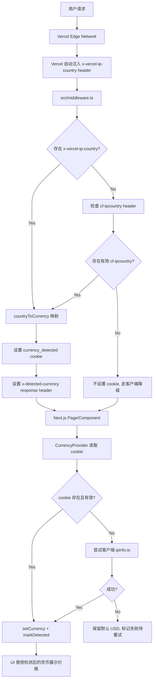

# 货币检测修复方案：Vercel 环境适配

## 1. 方案概述

**核心思路：利用 Vercel Edge Middleware 读取 `x-vercel-ip-country` header 完成服务端国家→货币检测，通过 cookie 传递给客户端，客户端仅作兜底降级。复用现有 [`countryToCurrency()`](src/lib/currency.ts:41) 映射逻辑，无需引入新依赖。**

---

## 2. 数据流图



**检测链路优先级：**
1. 🥇 Vercel `x-vercel-ip-country` header → Middleware → cookie（服务端，零成本）
2. 🥈 Cloudflare `cf-ipcountry` header → Middleware → cookie（非 Vercel 部署备用）
3. 🥉 客户端 `ipinfo.io` API 调用（每天 50000 次免费，无需 key 即可获取国家码，仅作兜底）
4. ❌ 全部失败 → 默认 USD

---

## 3. 改动文件清单

| # | 文件 | 操作 | 说明 |
|---|------|------|------|
| 1 | [`src/proxy.ts`](src/proxy.ts) | **新建** | Vercel Edge Proxy（Next.js 16 新命名），读取 IP country header，写 cookie |
| 2 | [`src/lib/currency.ts`](src/lib/currency.ts:57) | **修改** | 新增 `detectCurrencyFromVercelHeaders()` 函数，清理 `detectCountryFromHeaders()` 并同时支持 Vercel + Cloudflare |
| 3 | [`src/stores/currency-store.ts`](src/stores/currency-store.ts) | **修改** | 修复 persist 缓存失败状态问题；增加 `lastAttemptTimestamp`；分离 `isDetected` 和 `isManuallySet` |
| 4 | [`src/components/providers/currency-provider.tsx`](src/components/providers/currency-provider.tsx) | **修改** | 新增 cookie 读取逻辑；修复失败永久化问题；引入重试机制 |
| 5 | [`src/lib/utils.ts`](src/lib/utils.ts) | **可选修改** | 新增 cookie 读写工具函数（`getCookie`、`setCookie`） |

---

## 4. 详细设计

### 4.1 新建 [`src/proxy.ts`](src/proxy.ts)（Next.js 16 新约定，原名 middleware.ts）

**位置：** 项目根目录 `src/middleware.ts`

**职责：**
- 匹配所有页面路由（排除 `/_next/static`、`/api/` 等内部路径）
- 读取 Vercel 的 `x-vercel-ip-country` request header
- 如果不存在，兜底检查 `cf-ipcountry`（Cloudflare 场景）
- 用 `countryToCurrency()` 将国家码映射为货币
- 将结果写入 `currency_detected` cookie（非 httpOnly，客户端可读）
- 同时设置 `x-detected-currency` response header（Server Components 也可读取）

**关键设计决策：**
- **匹配路径：** 只匹配 `/(.*)?` 页面路由，跳过 `/_next/static`、`/_next/image`、`/favicon.ico`、`/api/`。
- **Cookie 设置：** `httpOnly: false`（客户端 JS 可读），`secure: true`（生产环境），`sameSite: 'Lax'`，`maxAge: 86400`（24 小时过期）。
- **为什么 24 小时？** 用户的 IP 地理位置一般不会频繁变动，24 小时过期足够；同时也确保如果用户跨境移动，24 小时后能重新检测。
- **不阻塞请求：** Middleware 中没有 await/fetch，纯同步操作，无性能开销。

**伪代码：**

```typescript
// src/middleware.ts
import { NextRequest, NextResponse } from 'next/server'
import { countryToCurrency, COOKIE_NAME } from '@/lib/currency'


export function middleware(request: NextRequest) {
  // 1. 尝试 Vercel header
  const countryCode =
    request.headers.get('x-vercel-ip-country') ||
    request.headers.get('cf-ipcountry')

  // 2. 如果已有有效 cookie，跳过（减少重复写入）
  const existingCookie = request.cookies.get(COOKIE_NAME)
  if (existingCookie?.value) {
    const currencyFromCookie = existingCookie.value
    // 验证 cookie 值是否仍在当前支持的货币列表
    if (['USD', 'EUR', 'GBP'].includes(currencyFromCookie)) {
      return NextResponse.next()
    }
  }

  // 3. 检测并写入 cookie
  if (countryCode && countryCode !== 'XX' && countryCode !== '??') {
    const currency = countryToCurrency(countryCode)
    const response = NextResponse.next()
    
    response.cookies.set(COOKIE_NAME, currency, {
      httpOnly: false,
      secure: process.env.NODE_ENV === 'production',
      sameSite: 'lax',
      maxAge: 60 * 60 * 24, // 24 hours
      path: '/',
    })
    
    // 也设置 response header（给 Server Components 通过 headers() 读取）
    response.headers.set('x-detected-currency', currency)
    
    return response
  }

  return NextResponse.next()
}

export const config = {
  matcher: [
    '/((?!_next/static|_next/image|favicon.ico|api/).*)',
  ],
}
```

### 4.2 修改 [`src/lib/currency.ts`](src/lib/currency.ts)

**改动点：**
1. 新增 `COOKIE_NAME` 常量供 middleware 和 provider 共享
2. 新增 `detectCurrencyFromVercelHeaders()` — 同时支持 Vercel 和 Cloudflare
3. 保留 `detectCountryFromHeaders()` 但标记为 `@deprecated`，调用方改为新函数
4. 保留 `detectCurrencyFromIP()` 作为客户端兜底

**关键设计决策：**
- `COOKIE_NAME` 作为共享常量放在 `currency.ts` 中，避免 middleware 和 provider 硬编码字符串。
- `detectCurrencyFromVercelHeaders()` 比原 `detectCountryFromHeaders()` 更通用：先查 Vercel 再降级到 Cloudflare。

**伪代码：**

```typescript
// src/lib/currency.ts 新增内容

/** Cookie name for storing detected currency */
export const COOKIE_NAME = 'currency_detected'

/** Valid currency codes for cookie validation */
export const VALID_CURRENCIES: SupportedCurrency[] = ['USD', 'EUR', 'GBP']

/**
 * Detect currency from Vercel Edge Network headers.
 * Priority: x-vercel-ip-country > cf-ipcountry
 * Returns null if neither header is available/valid.
 */
export function detectCurrencyFromVercelHeaders(
  headers: Headers
): SupportedCurrency | null {
  // Vercel provides this header automatically on Edge Middleware
  const country =
    headers.get('x-vercel-ip-country') ||
    headers.get('cf-ipcountry')

  if (country && country !== 'XX' && country !== '??') {
    return countryToCurrency(country)
  }

  return null
}

/**
 * @deprecated Use detectCurrencyFromVercelHeaders() instead,
 * which supports both Vercel and Cloudflare headers.
 */
export function detectCountryFromHeaders(headers: Headers): SupportedCurrency | null {
  return detectCurrencyFromVercelHeaders(headers)
}
```

### 4.3 修改 [`src/stores/currency-store.ts`](src/stores/currency-store.ts)

**问题：**
- `persist` + `isDetected=true` 导致检测失败后，刷新页面也不会重试
- `markDetected()` 在 `finally` 中调用，无论成功失败都永久标记

**修改方案：**

```typescript
interface CurrencyState {
  currency: SupportedCurrency
  /** Whether auto-detection has completed successfully */
  isDetected: boolean
  /** Whether user manually selected a currency (vs auto-detected) */
  isManuallySet: boolean
  /** Timestamp of last detection attempt (for retry logic) */
  lastAttemptAt: number | null
}
```

**关键设计决策：**
- **不持久化 `isDetected`**：使用 `partialize` 只持久化 `currency` 和 `isManuallySet`，不持久化 `isDetected`。这样刷新页面后 `isDetected` 回到 `false`，provider 会重新尝试检测。
- **`isManuallySet` 新状态**：当用户通过 [`CurrencySelector`](src/components/ui/currency-selector.tsx:15) 手动选择货币时标记，此时即使 `isDetected=false` 也不再覆盖用户的主动选择。
- **`lastAttemptAt` 新字段**：记录上次检测时间戳，provider 可据此决定是否跳过重试（比如 5 分钟内不重复请求 `ipapi.co`）。
- **`setCurrency` 行为区分**：如果是用户手动选择，同时设 `isManuallySet=true`；如果是自动检测，不修改 `isManuallySet`。

**伪代码：**

```typescript
// src/stores/currency-store.ts

// 只持久化 <currency, isManuallySet>，不持久化 isDetected
partialize: (state) => ({
  currency: state.currency,
  isManuallySet: state.isManuallySet,
}),
```

### 4.4 修改 [`src/components/providers/currency-provider.tsx`](src/components/providers/currency-provider.tsx)

**修改点：**
1. 首先尝试从 cookie 读取（Middleware 写入的 `currency_detected`）
2. cookie 有效 → 直接设置，跳过客户端 API 调用（零成本）
3. cookie 无效/不存在 → 检查是否在重试冷却期内
4. 不在冷却期 → 尝试 `ipinfo.io`（免费版每天 50000 次，无需 API key 即可获取国家码字段）
5. 失败 → 不设置 `isDetected=true`，记录 `lastAttemptAt`，等待下次重试

**关键设计决策：**
- **重试冷却期：** 5 分钟。失败后等待至少 5 分钟再重试，避免频繁调用 `ipapi.co` 耗尽配额。
- **Cookie 优先读取：** 使用 `document.cookie` 读取 `currency_detected`，正则匹配提取值。
- **同时检查 `isManuallySet`：** 如果用户手动选择了货币，不再覆盖。
- **cleanup 优化：** 区分 "首次检测" 和 "重试" 两个 effect，避免不必要的重试触发。

**伪代码：**

```typescript
'use client'

import { useEffect } from 'react'
import { useCurrencyStore } from '@/stores/currency-store'
import { detectCurrencyFromIP, COOKIE_NAME, VALID_CURRENCIES } from '@/lib/currency'
import { getCookie } from '@/lib/utils'

const RETRY_INTERVAL_MS = 5 * 60 * 1000 // 5 minutes

function readCurrencyCookie(): string | null {
  const value = getCookie(COOKIE_NAME)
  if (value && VALID_CURRENCIES.includes(value as any)) {
    return value
  }
  return null
}

export function CurrencyProvider() {
  const { currency, isDetected, isManuallySet, lastAttemptAt,
          setCurrency, markDetected, setLastAttempt } = useCurrencyStore()

  useEffect(() => {
    // Priority 1: User manually selected — never override
    if (isManuallySet) return

    // Priority 2: Read cookie set by Middleware (fastest path)
    const cookieCurrency = readCurrencyCookie()
    if (cookieCurrency && cookieCurrency !== currency) {
      setCurrency(cookieCurrency as any)
      markDetected()
      return
    }
    if (cookieCurrency) {
      // Cookie matches current currency, just mark as detected
      if (!isDetected) markDetected()
      return
    }

    // Priority 3: Already detected successfully, skip
    if (isDetected) return

    // Priority 4: Rate limiting — check retry interval
    if (lastAttemptAt && Date.now() - lastAttemptAt < RETRY_INTERVAL_MS) {
      return // Still in cooling period
    }

    // Priority 5: Client-side fallback detection
    const detect = async () => {
      setLastAttempt(Date.now())
      try {
        const detected = await detectCurrencyFromIP()
        if (detected) {
          setCurrency(detected)
          markDetected()
        }
      } catch {
        // Failed — isDetected remains false, will retry after cooling
        console.warn('Currency detection failed, will retry in 5min')
      }
    }

    detect()
  }, [isManuallySet, isDetected, lastAttemptAt, currency, setCurrency, markDetected, setLastAttempt])

  return null
}
```

### 4.5 可选：在 [`src/lib/utils.ts`](src/lib/utils.ts) 新增 cookie 工具

```typescript
// src/lib/utils.ts 新增

/**
 * Read a cookie value by name from document.cookie
 */
export function getCookie(name: string): string | null {
  if (typeof document === 'undefined') return null
  const match = document.cookie.match(new RegExp(`(?:^|;\\s*)${name}=([^;]*)`))
  return match ? decodeURIComponent(match[1]) : null
}

/**
 * Set a cookie with the given options
 */
export function setCookie(
  name: string,
  value: string,
  options?: { maxAge?: number; path?: string; secure?: boolean; sameSite?: 'lax' | 'strict' }
): void {
  if (typeof document === 'undefined') return
  const parts = [`${name}=${encodeURIComponent(value)}`]
  if (options?.maxAge) parts.push(`max-age=${options.maxAge}`)
  if (options?.path) parts.push(`path=${options.path}`)
  if (options?.secure) parts.push('secure')
  if (options?.sameSite) parts.push(`SameSite=${options.sameSite}`)
  document.cookie = parts.join('; ')
}
```

---

## 5. 各场景行为对比

| 场景 | 当前行为（有问题） | 修复后的行为 |
|------|-------------------|-------------|
| Vercel 部署 + 英国 IP | 显示 USD | **显示 GBP**（Middleware 检测 → cookie → provider 读取） |
| Vercel 部署 + 法国 IP | 显示 USD | **显示 EUR** |
| 非 Vercel 部署（Cloudflare） | 显示 USD（虽然有 `cf-ipcountry` 但从未调用） | 显示对应货币（Middleware 降级到 Cloudflare header） |
| 本地开发（localhost） | 调用 `ipapi.co` 可能失败 | 显示 USD（无 Vercel/Cloudflare header，cookie 为空，`ipapi.co` 兜底） |
| 检测失败后刷新页面 | 不重试（`isDetected=true` 被 persist） | **重试**（`isDetected` 不持久化，5 分钟冷却） |
| 用户手动选了 EUR，然后跨境旅行 | 自动检测覆盖手动选择 | **保留 EUR**（`isManuallySet` 阻止自动覆盖） |
| deploy preview / 预览分支 | 可能获取不到正确 IP | fallback 到 `ipapi.co` 客户端检测 |

---

## 6. 降级与边界情况

### 6.1 Cookie 不可用（用户禁用 cookie）
- Middleware still sets `x-detected-currency` response header
- Server Components 可以通过 `headers()` API 读取
- Provider 中 cookie 读取失败 → 走 `ipapi.co` 客户端兜底
- 最终降级：默认 USD

### 6.2 Vercel header 不可用
- 非 Vercel 环境（如 Netlify、Docker 部署）不存在 `x-vercel-ip-country`
- Middleware 降级检查 `cf-ipcountry`（Cloudflare）
- 如果也不存在 → 不设置 cookie → 客户端 `ipapi.co` 兜底

### 6.3 Vercel local development
- 本地 `next dev` 时 Middleware 运行但无 `x-vercel-ip-country` header
- 行为同 6.2：cookie 为空 → 客户端检测 → 可能调用 `ipapi.co`
- 可在 `.env.local` 中新增 `NEXT_PUBLIC_DISABLE_GEO_DETECTION=true` 完全禁用检测

### 6.4 ipapi.co 限流
- 免费版每天 1000 次
- 5 分钟冷却期：假设最坏情况每次失败都重试，每天最多重试 288 次（24h / 5min × 1次）
- 实际上正常用户首次访问 cookie 就命中，根本不会走到 `ipapi.co`
- **对于大量 bot 流量或频繁刷新的用户**：如果每天 1000 次配额仍不够，可考虑更换为免费方案如 `ip-api.com` 或 `ipinfo.io`（后者每天 50000 次免费）

### 6.5 deploy preview / preview 分支
- Vercel Preview Deployments 会正确注入 `x-vercel-ip-country`
- 但 IP 可能对应 Vercel 的构建节点，不是真实用户 IP
- 解决方案：依赖客户端检测作为预览环境的兜底

---

## 7. 测试清单

- [ ] Vercel 部署 + 英国 IP → 页面显示 GBP，cookie 值为 `GBP`
- [ ] Vercel 部署 + 法国 IP → 页面显示 EUR
- [ ] Vercel 部署 + 美国 IP → 页面显示 USD（默认）
- [ ] 删除 cookie 后刷新 → 5 分钟内显示 USD，5 分钟后尝试客户端检测
- [ ] 用户手动选择 EUR → 即使检测到 GBP 也不覆盖
- [ ] 本地 `npm run dev` → 正常显示 USD，控制台无报错
- [ ] `npm run build` TypeScript 编译无错误
- [ ] API webhook 路径 `/api/webhooks/stripe` 不会被 Middleware 拦截

---

## 8. 不纳入本次方案的项（未来考虑）

- **`@vercel/functions` `geolocation()`**：这是 Vercel Edge Functions 的 API，当前项目使用 Edge Middleware 已足够。如果未来需要更细粒度的地理位置数据（城市、时区），可以考虑使用。
- **独立 IP Geolocation API 服务**：如果 `ipinfo.io` 配额仍不够，可考虑自建服务或使用付费版。
- **Server Components 直接读取 header**：当前 Middleware 通过 `x-detected-currency` response header 传递。未来可以探索在 Server Components 中通过 `headers()` API 直接读取，减少对客户端的依赖，但这需要重构价格展示组件，改动范围较大。

---

## 9. 实施步骤（建议执行顺序）

1. **修改 [`src/lib/currency.ts`](src/lib/currency.ts)**：新增 `COOKIE_NAME`、`VALID_CURRENCIES`、`detectCurrencyFromVercelHeaders()`
2. **新增 [`src/middleware.ts`](src/middleware.ts)**：实现 Vercel IP 检测 + cookie 写入
3. **修改 [`src/stores/currency-store.ts`](src/stores/currency-store.ts)**：修复 persist、新增字段
4. **可选修改 [`src/lib/utils.ts`](src/lib/utils.ts)**：新增 cookie 工具函数
5. **修改 [`src/components/providers/currency-provider.tsx`](src/components/providers/currency-provider.tsx)**：cookie 优先 + 重试逻辑
6. **本地验证**：`npm run build` 确认编译通过
7. **部署到 Vercel 验证**：检查英国 IP 是否显示 GBP
